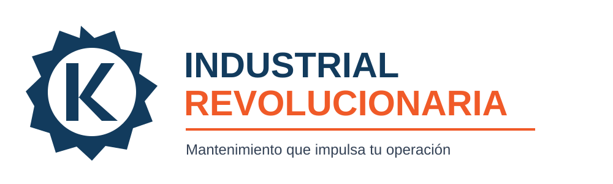

**Asignatura:** Plan de Negocios (GGPN01)  
**Actividad:** 6 - Imagen de la empresa
**Proyecto:** Industrial Revolucionaria  
**Ubicación propuesta:** Monterrey, Nuevo León y su zona metropolitana

{width=85%}

## Nombre del proyecto

El nombre **Industrial Revolucionaria** identifica una empresa de mantenimiento y soluciones industriales para micro, pequeñas y medianas empresas de Monterrey y su zona metropolitana. La palabra *Industrial* comunica de manera directa el sector atendido y facilita que el público relacione el proyecto con equipos, instalaciones, seguridad y continuidad operativa. *Revolucionaria* expresa la intención de transformar el mantenimiento reactivo en un servicio planificado, documentado y orientado a la mejora continua.

El nombre se eligió en español para facilitar su pronunciación, comprensión y recordación en el mercado local. Es breve, relaciona el giro con una propuesta de cambio y es congruente con el propósito del proyecto: reducir paros operativos mediante diagnóstico, mantenimiento preventivo y correctivo, seguimiento de órdenes de trabajo y gestión de refacciones. Antes de su uso comercial, será necesario verificar su disponibilidad ante las instancias correspondientes y probar su recordación con clientes potenciales.

## Logotipo propuesto

El logotipo fue diseñado por el estudiante como propuesta original para esta actividad. Está formado por un engrane simplificado que enmarca el monograma **IR**. El engrane representa maquinaria, precisión técnica y el trabajo continuo de las operaciones industriales; el monograma permite identificar de forma compacta el nombre de la empresa en uniformes, vehículos, órdenes de servicio y medios digitales.

El azul industrial (`#123B5D`) se eligió para comunicar confianza, orden y profesionalismo; el naranja de seguridad (`#F05A28`) funciona como acento visual para representar energía, atención y respuesta ante contingencias. La combinación permite contraste en aplicaciones impresas o digitales y mantiene legibilidad en formatos pequeños. Estas asociaciones son criterios de diseño; su aceptación deberá validarse con el mercado objetivo antes de consolidar la identidad.

## Lema

El lema propuesto es **“Mantenimiento que impulsa tu operación”**. Su origen se encuentra en la idea de que el mantenimiento no debe limitarse a reparar fallas, sino contribuir a la continuidad, seguridad y eficiencia de las empresas clientes. El verbo *impulsa* relaciona el servicio técnico con un resultado operativo, sin prometer eliminar por completo las fallas o los paros.

De forma estratégica, el lema ayuda a explicar la propuesta de valor en un mensaje breve y complementa el logotipo en presentaciones, cotizaciones, vehículos y medios digitales. También diferencia el proyecto de servicios que se comunican sólo como reparación de emergencia, al destacar el mantenimiento como apoyo para la operación del cliente. Su comprensión y capacidad de diferenciación deberán probarse mediante entrevistas con responsables de mantenimiento, planta y compras.

## Validación pendiente

La identidad presentada es una propuesta académica. Antes de adoptarla como imagen comercial se validará la disponibilidad del nombre, la originalidad del signo, la legibilidad en escala de grises, la reproducción en distintos materiales y la opinión de clientes potenciales. Asimismo, la entrega final debe conservar el formato Word solicitado por el módulo 6545; este archivo se exporta a ese formato como evidencia de trabajo.