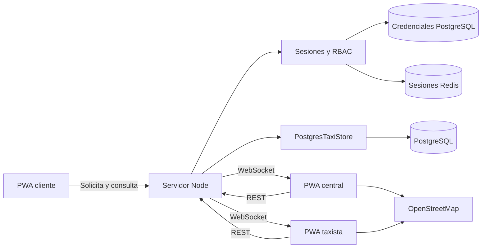

# Arquitectura de vTaxi

Estado operativo y límites actualizados al 11 de septiembre de 2026. Consulta la
[guía de operación y accesos](OPERACION-Y-ACCESOS.md) para procedimientos web,
CLI, recuperación, respaldos y publicación.

## Principios

El repositorio sigue el enfoque operativo de las webapps de `vWireGuard`:
interfaz PWA en espanol, servidor Node pequeno, configuracion por entorno,
estado vivo por WebSocket, service worker conservador y pruebas desde el dominio.

La carpeta `base/` contiene proyectos usados solo como referencia. Los proyectos
con procedencia verificable son submódulos fijados a commits de espejos privados
propios, independientes de sus upstreams históricos; el snapshot Ionic permanece
aislado y saneado. Ninguno forma parte del artefacto de producción ni es una
dependencia del servidor. No se copia su arquitectura de microservicios porque
seria innecesaria para validar el flujo principal de una sola base de taxis.
Consulta [BASE-PROJECTS.md](BASE-PROJECTS.md).

## Componentes

`TaxiStore` es la unica autoridad para publicar, asignar y avanzar viajes. Cada
solicitud declara unidades requeridas y contiene una asignacion independiente
por taxista. La solicitud permanece disponible hasta cubrir todos sus cupos.
Cada mutacion se ejecuta en una transaccion y luego se distribuye una instantanea
filtrada por rol. La restriccion `(ride_id, driver_id)` impide cupos duplicados y
un indice parcial impide que una unidad tenga dos asignaciones activas.

El cliente crea `solicitado`; la central decide `publicado` o `rechazado`; el
conductor crea una asignacion `aceptado`; y la central la convierte en
`asignado` antes de permitir `en_camino`, `en_sitio`, `en_viaje` y `completado`.

## Contrato operativo

| Metodo | Ruta | Funcion |
| --- | --- | --- |
| `GET` | `/api/health` | Salud del servicio |
| `POST` | `/api/session` | Intercambia clave por sesion HttpOnly |
| `DELETE` | `/api/session` | Cierra sesion |
| `GET` | `/api/admin/accesses` | Lista metadatos de accesos persistentes |
| `POST` | `/api/admin/accesses` | Emite un acceso y devuelve la clave una sola vez |
| `POST` | `/api/admin/accesses/:id/rotate` | Rota un acceso activo |
| `POST` | `/api/admin/accesses/:id/revoke` | Revoca un acceso y sus sesiones posteriores |
| `GET` | `/api/admin/audit` | Auditoría persistente de accesos; `limit` o `lines`, máximo 1000 |
| `GET` | `/api/metrics` | Métricas básicas del proceso para central |
| `GET` | `/api/rides` | Lista de viajes; acepta `?status=` |
| `POST` | `/api/rides` | Publica un viaje |
| `POST` | `/api/rides/:id/publish` | Central publica una solicitud |
| `POST` | `/api/rides/:id/reject` | Central rechaza una solicitud |
| `POST` | `/api/rides/:id/accept` | Asigna un taxista disponible |
| `POST` | `/api/rides/:id/assignments/:driverId/validate` | Central valida o rechaza conductor |
| `POST` | `/api/rides/:id/status` | Avanza una etapa valida |
| `GET` | `/api/drivers` | Lista la flota |
| `PATCH` | `/api/drivers/:id` | Actualiza el perfil con campos filtrados por rol |
| `GET` | `/api/route` | Calcula ruta vial, distancia y duracion con OSRM |
| `POST` | `/api/drivers/:id/location` | Actualiza posicion |
| `WS` | `/events` | Instantaneas y cambios en vivo |
| `WS` | `/passenger-events` | Proyección del viaje autorizada para el pasajero |

El conductor puede actualizar únicamente su teléfono, correo y contacto de
emergencia. La central puede corregir además nombre, unidad y vehículo. El
identificador, estado operativo, GPS, calificación y credenciales nunca se
aceptan en este endpoint. Las credenciales se administran en PostgreSQL: cada
clave se almacena con hash `scrypt`, se muestra una sola vez al emitirla o
rotarla y puede revocarse sin reiniciar el servicio. La auditoría de esas
operaciones también queda en PostgreSQL.

## Identidades, credenciales y paneles

`dispatcher` sigue agrupando administrador y central. No hay un rol independiente
de superadministrador. `driver` se vincula a una unidad y `customer` a solicitudes
de su cuenta; el pasajero utiliza un flujo anónimo de capacidad privada.

La PWA y la CLI usan las mismas APIs administrativas. La PWA abre Administración
para `dispatcher`, con Resumen, Personas y empresas, Accesos y Auditoría. Despacho
y Flota conservan el mapa y las acciones operativas. El directorio combina datos
existentes; no implementa aún un catálogo empresarial completo. Sus filtros y
páginas de diez registros se calculan en el navegador.

`access_credentials` almacena huella SHA-256, hash `scrypt` con sal, rol, sujeto,
estado y fechas. La huella permite buscar el registro; no se conserva el secreto
recuperable. Solo puede existir una credencial activa por rol/sujeto. Emisión y
rotación devuelven una nueva clave una vez. La revocación del último administrador
se bloquea con `409` dentro de una transacción con bloqueo de filas.

El bootstrap importa credenciales de entorno o configuración heredada únicamente
cuando no hay registros en la tabla. Una base inicializada no se actualiza al
cambiar `.env`, Secrets Manager ni un sobre local. La recuperación local autorizada
también utiliza el repositorio de credenciales; no añade un bypass web de PIN.

`admin_audit_events` conserva eventos de emisión y revocación. Una rotación se
registra como emisión con enlace a la credencial anterior. No hay garantías de
inmutabilidad, cobertura integral, IP de origen ni identificación individual
completa del actor administrativo en la implementación actual.

Las sesiones con `credentialId` verifican que la credencial siga activa al resolver
una petición HTTP. Los WebSockets ya abiertos no se revalidan continuamente;
su cierre inmediato al revocar sigue pendiente. El servicio utiliza Redis si está
configurado y memoria como fallback.

## Limites deliberados

- El JSON de viajes sirve como fallback de demostración, no como almacén operativo
    de producción. Persisten rutas administrativas heredadas de clientes y tokens
    que usan archivos/memoria; no deben utilizarse para gestionar accesos PostgreSQL.
- El OSRM publico es solo para prototipo; produccion requiere instancia propia o SLA.
- La coordenada demo de Regal Rexnord Planta 2 debe validarse en campo.
- Sin Redis las sesiones viven en memoria y se pierden al reiniciar. Redis
    compartido no demuestra por sí solo alta disponibilidad ni revocación de sockets.
- No se almacena aun un historial inmutable de auditoria ni telemetria de produccion.
- Los volúmenes Docker no implican cifrado de disco o backups; debe verificarse en
    la infraestructura. Las claves aleatorias son preferibles a PIN humanos.

Antes de operar con viajes reales faltan observabilidad, copias verificadas,
auditoria inmutable, politica de privacidad y pruebas de GPS por dispositivo.

## Despliegue activo Docker

La PWA está publicada en `https://16.58.100.160/` mediante Compose y Caddy. El
[publicador Linux](../scripts/deploy-docker-public.sh) construye y espera servicios
saludables; Compose ordena migración y catálogo antes del arranque de la app.
PostgreSQL y Redis tienen volúmenes persistentes y puertos en loopback. El puerto
directo `8443` tiene bind público por defecto; debe limitarse o bloquearse externamente.

Caddy gestiona el certificado público por ACME. El salto HTTPS interno a Node
omite la verificación del certificado, dentro de la red del stack.

## Alternativa de despliegue AWS

La implementación de piloto en AWS usa CloudFront, ALB, una tarea ECS Fargate y
RDS PostgreSQL privado. El pipeline de imagen usa S3, CodeBuild y ECR. Las
migraciones se ejecutan como tarea Fargate one-shot antes de activar el servicio.

La topología, límites, variables, seguridad y costos están en
[AWS-ARCHITECTURE.md](AWS-ARCHITECTURE.md). Los procedimientos de reconstrucción,
actualización, diagnóstico, recuperación y desmontaje están en
[AWS-RUNBOOK.md](AWS-RUNBOOK.md).
