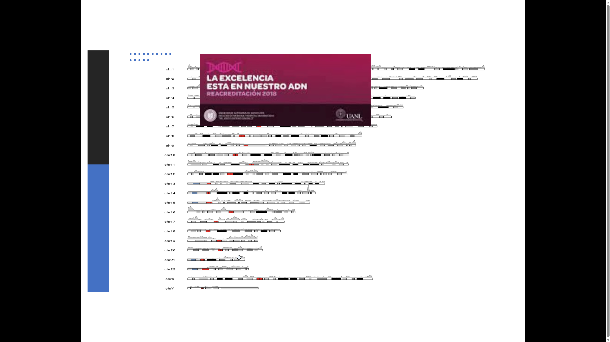

# Catálogo de capturas de Biología celular

Inventario de las 90 imágenes originales de `referencias/2026-10/`. La numeración identifica archivos, no el orden de una clase. La clasificación se basa en su contenido visual.

[Volver al índice](guias-biologia-celular.md)

| ID | Contenido | Guía | Archivo original |
| --- | --- | --- | --- |
| C01 | Transcripción inversa en retrovirus | [Guía 5](guia-05-transcripcion-arn.md) | [Abrir captura](referencias/2026-10/msedge_0TMYftLtJi.jpg) |
| C02 | Histonas y formación del nucleosoma | [Guía 2](guia-02-nucleo-celular.md) | [Abrir captura](referencias/2026-10/msedge_1A4Bobkqu4.jpg) |
| C03 | Potenciadores de la transcripción | [Guía 5](guia-05-transcripcion-arn.md) | [Abrir captura](referencias/2026-10/msedge_2uy4XRQLk7.jpg) |
| C04 | ARN de transferencia | [Guía 6](guia-06-traduccion-mutaciones.md) | [Abrir captura](referencias/2026-10/msedge_2YMwphFs47.png) |
| C05 | Iniciación de la transcripción bacteriana | [Guía 5](guia-05-transcripcion-arn.md) | [Abrir captura](referencias/2026-10/msedge_2ZoQeZl4jH.png) |
| C06 | Comparación de sistemas de reparación | [Guía 4](guia-04-dano-reparacion-adn.md) | [Abrir captura](referencias/2026-10/msedge_4p9FdQCxN9.jpg) |
| C07 | MMR bacteriano y metilación | [Guía 4](guia-04-dano-reparacion-adn.md) | [Abrir captura](referencias/2026-10/msedge_5erUbp8hIY.png) |
| C08 | Ácidos nucleicos y ADN extranuclear | [Guía 3](guia-03-replicacion-adn.md) | [Abrir captura](referencias/2026-10/msedge_7ii2aRXrsB.jpg) |
| C09 | Transcripción de genes procariotas | [Guía 5](guia-05-transcripcion-arn.md) | [Abrir captura](referencias/2026-10/msedge_8njj5Rp6ps.png) |
| C10 | Polimerasas I y III | [Guía 5](guia-05-transcripcion-arn.md) | [Abrir captura](referencias/2026-10/msedge_8oMyR7Y386.png) |
| C11 | Portada: síntesis y procesamiento del ARN | [Guía 5](guia-05-transcripcion-arn.md) | [Abrir captura](referencias/2026-10/msedge_8pL0CsETYM.png) |
| C12 | Cebador de ARN | [Guía 3](guia-03-replicacion-adn.md) | [Abrir captura](referencias/2026-10/msedge_9E42O9FG6r.jpg) |
| C13 | Portada: reparación del ADN | [Guía 4](guia-04-dano-reparacion-adn.md) | [Abrir captura](referencias/2026-10/msedge_9PcqezsCii.png) |
| C14 | Terminación bacteriana: Tus y sitios ter | [Guía 3](guia-03-replicacion-adn.md) | [Abrir captura](referencias/2026-10/msedge_ASjrD4FmKK.jpg) |
| C15 | Replicación semiconservativa | [Guía 3](guia-03-replicacion-adn.md) | [Abrir captura](referencias/2026-10/msedge_B3G5jxF4Rg.jpg) |
| C16 | Etapas de la síntesis de ARN | [Guía 5](guia-05-transcripcion-arn.md) | [Abrir captura](referencias/2026-10/msedge_beNGHZbuwg.png) |
| C17 | Reparación de apareamientos erróneos | [Guía 4](guia-04-dano-reparacion-adn.md) | [Abrir captura](referencias/2026-10/msedge_bvwDDqZlrr.jpg) |
| C18 | ARN y transcripción | [Guía 5](guia-05-transcripcion-arn.md) | [Abrir captura](referencias/2026-10/msedge_CpS4cgNWIv.png) |
| C19 | Portada: reparación | [Guía 4](guia-04-dano-reparacion-adn.md) | [Abrir captura](referencias/2026-10/msedge_d7WlWlsmWf.jpg) |
| C20 | Desaminación de bases | [Guía 4](guia-04-dano-reparacion-adn.md) | [Abrir captura](referencias/2026-10/msedge_ELxsAtbaYk.png) |
| C21 | Inhibición de ARN polimerasa II | [Guía 5](guia-05-transcripcion-arn.md) | [Abrir captura](referencias/2026-10/msedge_fdpueOP52Y.jpg) |
| C22 | Promotores de polimerasa II | [Guía 5](guia-05-transcripcion-arn.md) | [Abrir captura](referencias/2026-10/msedge_FG754IVEPS.png) |
| C23 | Procesamiento del ARNm (texto superpuesto) | [Guía 5](guia-05-transcripcion-arn.md) | [Abrir captura](referencias/2026-10/msedge_foyFjX3QDT.png) |
| C24 | Telomerasa | [Guía 3](guia-03-replicacion-adn.md) | [Abrir captura](referencias/2026-10/msedge_ftx6mbmrPG.jpg) |
| C25 | ADN circular y organización del genoma | [Guía 3](guia-03-replicacion-adn.md) | [Abrir captura](referencias/2026-10/msedge_g8rmyNk6Tq.jpg) |
| C26 | Captura de plataforma del curso | Contexto del curso | [Abrir captura](referencias/2026-10/msedge_gH7uMMhNLk.png) |
| C27 | Inhibición de polimerasa bacteriana | [Guía 5](guia-05-transcripcion-arn.md) | [Abrir captura](referencias/2026-10/msedge_GV6HaMoaUf.jpg) |
| C28 | Reparación de roturas de doble cadena | [Guía 4](guia-04-dano-reparacion-adn.md) | [Abrir captura](referencias/2026-10/msedge_h6E9vamfM0.png) |
| C29 | Empalme alternativo | [Guía 5](guia-05-transcripcion-arn.md) | [Abrir captura](referencias/2026-10/msedge_H9q30Enj9b.png) |
| C30 | Fotografías introductorias sin contenido molecular | [Guía 4](guia-04-dano-reparacion-adn.md) | [Abrir captura](referencias/2026-10/msedge_hrAyQcpd5V.jpg) |
| C31 | Telómeros | [Guía 3](guia-03-replicacion-adn.md) | [Abrir captura](referencias/2026-10/msedge_Hrs8spzR0Z.jpg) |
| C32 | Mapa de estructura y replicación | [Guía 3](guia-03-replicacion-adn.md) | [Abrir captura](referencias/2026-10/msedge_HWVTjwkXK3.png) |
| C33 | Reparación por escisión de bases | [Guía 4](guia-04-dano-reparacion-adn.md) | [Abrir captura](referencias/2026-10/msedge_HYzjqmAkd5.png) |
| C34 | Composición del nucleosoma | [Guía 2](guia-02-nucleo-celular.md) | [Abrir captura](referencias/2026-10/msedge_i7MWblAlKk.jpg) |
| C35 | Replisoma eucariota | [Guía 3](guia-03-replicacion-adn.md) | [Abrir captura](referencias/2026-10/msedge_iaRHatm4pe.jpg) |
| C36 | Resumen de reparación del ADN | [Guía 4](guia-04-dano-reparacion-adn.md) | [Abrir captura](referencias/2026-10/msedge_inORg6mUsv.png) |
| C37 | Terminación dependiente de Rho | [Guía 5](guia-05-transcripcion-arn.md) | [Abrir captura](referencias/2026-10/msedge_ISraQcoUyX.jpg) |
| C38 | Actividad correctora de polimerasa | [Guía 3](guia-03-replicacion-adn.md) | [Abrir captura](referencias/2026-10/msedge_J79FDAspYd.jpg) |
| C39 | Ilustración introductoria de reparación | [Guía 4](guia-04-dano-reparacion-adn.md) | [Abrir captura](referencias/2026-10/msedge_jFcXEqIXm2.jpg) |
| C40 | Polimerasas nucleares | [Guía 5](guia-05-transcripcion-arn.md) | [Abrir captura](referencias/2026-10/msedge_JjawTUy5Zf.png) |
| C41 | Acortamiento de telómeros | [Guía 3](guia-03-replicacion-adn.md) | [Abrir captura](referencias/2026-10/msedge_JUXXDFF6pl.png) |
| C42 | Factores de transcripción | [Guía 5](guia-05-transcripcion-arn.md) | [Abrir captura](referencias/2026-10/msedge_KaESYsaiOC.png) |
| C43 | ARN ribosómico | [Guía 5](guia-05-transcripcion-arn.md) | [Abrir captura](referencias/2026-10/msedge_L4UqYSnMVX.jpg) |
| C44 | Polaridad y estructura del ADN | [Guía 3](guia-03-replicacion-adn.md) | [Abrir captura](referencias/2026-10/msedge_LAyJlJHASc.png) |
| C45 | Analogía introductoria del promotor | [Guía 5](guia-05-transcripcion-arn.md) | [Abrir captura](referencias/2026-10/msedge_leO4tgh8pB.jpg) |
| C46 | Topoisomerasas y superenrollamiento | [Guía 3](guia-03-replicacion-adn.md) | [Abrir captura](referencias/2026-10/msedge_lLHdpfGC4X.jpg) |
| C47 | Orígenes y horquillas | [Guía 3](guia-03-replicacion-adn.md) | [Abrir captura](referencias/2026-10/msedge_lXyh1G9wb1.png) |
| C48 | Terminación independiente de Rho | [Guía 5](guia-05-transcripcion-arn.md) | [Abrir captura](referencias/2026-10/msedge_lZKf1FMnMR.png) |
| C49 | Ciclo celular y ciclinas-CDK | [Guía 1](guia-01-ciclo-celular-mitosis.md) | [Abrir captura](referencias/2026-10/msedge_m3vrftcACe.jpg) |
| C50 | Pérdida o alteración espontánea de bases | [Guía 4](guia-04-dano-reparacion-adn.md) | [Abrir captura](referencias/2026-10/msedge_mhaNljR0yd.png) |
| C51 | Complementariedad de bases | [Guía 3](guia-03-replicacion-adn.md) | [Abrir captura](referencias/2026-10/msedge_mJxdNOWqZp.png) |
| C52 | Niveles de compactación de cromatina | [Guía 2](guia-02-nucleo-celular.md) | [Abrir captura](referencias/2026-10/msedge_Ms9W61OB4W.jpg) |
| C53 | ADN ligasa | [Guía 3](guia-03-replicacion-adn.md) | [Abrir captura](referencias/2026-10/msedge_N3y5tEnkU1.png) |
| C54 | MMR: genes de reparación | [Guía 4](guia-04-dano-reparacion-adn.md) | [Abrir captura](referencias/2026-10/msedge_NbuIWj9OL0.png) |
| C55 | Dirección de síntesis y fragmentos de Okazaki | [Guía 3](guia-03-replicacion-adn.md) | [Abrir captura](referencias/2026-10/msedge_Nhzvg1TMTf.png) |
| C56 | Reparación por escisión de nucleótidos | [Guía 4](guia-04-dano-reparacion-adn.md) | [Abrir captura](referencias/2026-10/msedge_NivRFHkrSw.jpg) |
| C57 | Imagen introductoria del ADN | [Guía 3](guia-03-replicacion-adn.md) | [Abrir captura](referencias/2026-10/msedge_NmcQmqNYXX.jpg) |
| C58 | Retrotransposones y transcripción inversa | [Guía 5](guia-05-transcripcion-arn.md) | [Abrir captura](referencias/2026-10/msedge_nv1g3n9yd8.png) |
| C59 | Genoma mitocondrial (ejemplo humano) | [Guía 3](guia-03-replicacion-adn.md) | [Abrir captura](referencias/2026-10/msedge_OAm25Gtapz.png) |
| C60 | Elongación del ADN | [Guía 3](guia-03-replicacion-adn.md) | [Abrir captura](referencias/2026-10/msedge_OesM3WOu28.jpg) |
| C61 | Procesamiento de ARN | [Guía 5](guia-05-transcripcion-arn.md) | [Abrir captura](referencias/2026-10/msedge_PpW6ME3yfK.jpg) |
| C62 | Doble hélice | [Guía 3](guia-03-replicacion-adn.md) | [Abrir captura](referencias/2026-10/msedge_Q1O8TQ6dtv.jpg) |
| C63 | Daño, reparación y mutación | [Guía 4](guia-04-dano-reparacion-adn.md) | [Abrir captura](referencias/2026-10/msedge_qMictKqJfn.jpg) |
| C64 | Escisión de ADN lesionado | [Guía 4](guia-04-dano-reparacion-adn.md) | [Abrir captura](referencias/2026-10/msedge_QvDj35gIn6.png) |
| C65 | Metabolismo de análogos de nucleósidos | [Guía 4](guia-04-dano-reparacion-adn.md) | [Abrir captura](referencias/2026-10/msedge_QwlSZ7r3hM.jpg) |
| C66 | Maquinaria de transcripción eucariota | [Guía 5](guia-05-transcripcion-arn.md) | [Abrir captura](referencias/2026-10/msedge_r4EgBWtstC.jpg) |
| C67 | Formación de la horquilla | [Guía 3](guia-03-replicacion-adn.md) | [Abrir captura](referencias/2026-10/msedge_rHk0az0Y8b.jpg) |
| C68 | Flujo de información genética | [Guía 5](guia-05-transcripcion-arn.md) | [Abrir captura](referencias/2026-10/msedge_riLRNj6n4N.png) |
| C69 | Replicación y transmisión celular | [Guía 1](guia-01-ciclo-celular-mitosis.md) | [Abrir captura](referencias/2026-10/msedge_rOWTh6sSyd.jpg) |
| C70 | Desnaturalización y renaturalización | [Guía 3](guia-03-replicacion-adn.md) | [Abrir captura](referencias/2026-10/msedge_RSWrxzBqpP.png) |
| C71 | Eucromatina y heterocromatina | [Guía 2](guia-02-nucleo-celular.md) | [Abrir captura](referencias/2026-10/msedge_rxdveWi8YA.jpg) |
| C72 | Portada: síntesis de proteínas | [Guía 6](guia-06-traduccion-mutaciones.md) | [Abrir captura](referencias/2026-10/msedge_SGvNBztFER.jpg) |
| C73 | ARNm mono y policistrónico | [Guía 5](guia-05-transcripcion-arn.md) | [Abrir captura](referencias/2026-10/msedge_T1ZIJIxgRi.png) |
| C74 | Elongación de la transcripción | [Guía 5](guia-05-transcripcion-arn.md) | [Abrir captura](referencias/2026-10/msedge_te5YbrdeMa.jpg) |
| C75 | Organización del ADN eucariota | [Guía 2](guia-02-nucleo-celular.md) | [Abrir captura](referencias/2026-10/msedge_U6nRI4JV27.jpg) |
| C76 | Mapa de estructura del ARN y transcripción | [Guía 5](guia-05-transcripcion-arn.md) | [Abrir captura](referencias/2026-10/msedge_uT0MfHK6Ta.png) |
| C77 | Polimerasa bacteriana y factor sigma | [Guía 5](guia-05-transcripcion-arn.md) | [Abrir captura](referencias/2026-10/msedge_VK8K056OLg.png) |
| C78 | Portada: ADN y replicación procariota | [Guía 3](guia-03-replicacion-adn.md) | [Abrir captura](referencias/2026-10/msedge_VR11xZTKTO.png) |
| C79 | Retiro de cebadores | [Guía 3](guia-03-replicacion-adn.md) | [Abrir captura](referencias/2026-10/msedge_vv4lW9RF98.jpg) |
| C80 | ADN polimerasas eucariotas | [Guía 3](guia-03-replicacion-adn.md) | [Abrir captura](referencias/2026-10/msedge_w1lHcefiVm.png) |
| C81 | Procesamiento del ARNr | [Guía 5](guia-05-transcripcion-arn.md) | [Abrir captura](referencias/2026-10/msedge_wCHiMxRdPe.png) |
| C82 | Mutaciones en sitios de empalme | [Guía 6](guia-06-traduccion-mutaciones.md) | [Abrir captura](referencias/2026-10/msedge_xjFJEbB7XS.png) |
| C83 | Empalme alternativo | [Guía 5](guia-05-transcripcion-arn.md) | [Abrir captura](referencias/2026-10/msedge_XjUphTFrhr.png) |
| C84 | Portada: transcripción eucariota | [Guía 5](guia-05-transcripcion-arn.md) | [Abrir captura](referencias/2026-10/msedge_XwGfzFM84Z.png) |
| C85 | Análogos de nucleósidos y replicación | [Guía 3](guia-03-replicacion-adn.md) | [Abrir captura](referencias/2026-10/msedge_XY7a27uu6D.png) |
| C86 | Procesamiento del ARNt | [Guía 6](guia-06-traduccion-mutaciones.md) | [Abrir captura](referencias/2026-10/msedge_xzQGkJCtGe.png) |
| C87 | Portada: transcripción procariota | [Guía 5](guia-05-transcripcion-arn.md) | [Abrir captura](referencias/2026-10/msedge_yDCcSlNTFX.jpg) |
| C88 | Transcripción en eucariotas | [Guía 5](guia-05-transcripcion-arn.md) | [Abrir captura](referencias/2026-10/msedge_Ymg9aTxxyF.jpg) |
| C89 | Portada: replicación eucariota | [Guía 3](guia-03-replicacion-adn.md) | [Abrir captura](referencias/2026-10/msedge_YUo7UxQrx4.png) |
| C90 | Corte y empalme | [Guía 5](guia-05-transcripcion-arn.md) | [Abrir captura](referencias/2026-10/msedge_Z4lPX1XEho.png) |

## Captura de contexto

La siguiente captura muestra la plataforma y no aporta un proceso celular. Se conserva como parte del conjunto recibido.

## Calidad y lectura

La captura C23 contiene texto superpuesto: utiliza la explicación de procesamiento de ARNm de la guía 5. Las portadas y analogías se incluyen para conservar el conjunto, pero las preguntas se apoyan en las figuras y los conceptos desarrollados. Las capturas C30 y C45 son introducciones visuales, sin información molecular suficiente para evaluar conocimientos.

## Auditoría de las 90 capturas

**Fecha:** 4 de octubre de 2026. Se comprobó la apertura de los 90 archivos y se inspeccionaron visualmente las 90 capturas en 15 láminas numeradas. La revisión permite identificar contenido, solapamientos, recortes y afirmaciones problemáticas visibles; no certifica como correcto cada rótulo microscópico, cifra clínica o referencia incrustada. Los originales no se modificaron. Las láminas fueron auxiliares temporales, no fuentes nuevas.

**Uso de los dictámenes:** útil significa apoyo visual al concepto, no aprobación absoluta de cada frase. Con cautela exige leer la observación y la explicación textual de la guía. Documental no es contenido que deba memorizarse. Sustituir explicación indica que el texto de la guía debe ser la fuente de estudio principal. Las figuras con texto pequeño se consultan ampliadas en su archivo original; todas las explicaciones necesarias están desarrolladas en Markdown.

| ID | Dictamen | Observación y criterio de estudio |
| --- | --- | --- |
| C01 | Útil con contexto | Transcripción inversa y ciclo retroviral; no hay flujo de secuencia de proteína a ADN. |
| C02 | Útil | Nucleosomas y ADN conector; H1 no forma parte del octámero central. |
| C03 | Con cautela | Potenciadores y plegamiento de ADN; cis se refiere a la misma molécula, no necesariamente al gen más cercano. |
| C04 | Con cautela | Estructura de ARNt útil; porcentajes de ARN y tamaños no son constantes universales. |
| C05 | Con cautela | Promotor bacteriano -35/-10; el ensamblaje no se reduce a reconocer una caja y caminar hacia la otra. |
| C06 | Sustituir explicación | Figuras cubren texto de fondo y hay siglas variables; estudiar la tabla MMR/BER/NER de la guía 4. |
| C07 | Con cautela | Dam, GATC y discriminación por metilación corresponden al modelo E. coli; no a todas las bacterias. |
| C08 | Con cautela | ADN extranuclear correcto como idea; no toda bacteria tiene un único cromosoma ni plásmidos. |
| C09 | Con cautela | Hebras y transcripción; equivalencia codificante-ARN exige cambiar T por U y considerar procesamiento. |
| C10 | Con cautela | Polimerasa III y promotores internos de ciertos genes; polimerasas mitocondriales no son simplemente la enzima bacteriana. |
| C11 | Documental | Portada de síntesis y procesamiento; no agrega un mecanismo evaluable. |
| C12 | Con cautela | Cebador y extremo 3'-OH; longitud del cebador y número de inicios dependen del sistema. |
| C13 | Documental | Portada de reparación. |
| C14 | Con cautela | Tus es proteína y ter es ADN; el bloqueo de horquillas es específico del modelo E. coli. |
| C15 | Útil | Semiconservación; cada molécula hija conserva una hebra parental. |
| C16 | Útil | Iniciación, elongación y terminación; el dibujo es general y no sustituye mecanismos específicos. |
| C17 | Sustituir explicación | Texto habla de MMR, pero la figura muestra revisión exonucleasa; separar ambos procesos. |
| C18 | Con cautela | Tipos de ARN y compartimentos; nomenclatura 28S corresponde al modelo animal, 25S es habitual en plantas. |
| C19 | Documental | Ilustración de portada, no descripción literal de reparación. |
| C20 | Con cautela | C a U y A a hipoxantina son útiles; no memorizar G a A como resultado universal de desaminación de G. |
| C21 | Útil con contexto | Alfa-amanitina e inhibición de polimerasa II; ejemplo de diana, no recomendación médica. |
| C22 | Útil con contexto | Promotores de II heterogéneos; no todos tienen TATA y cis no equivale a un único gen cercano. |
| C23 | Sustituir explicación | Texto severamente superpuesto; utilizar tabla y esquema textual de procesamiento de la guía 5. |
| C24 | Con cautela | ARN molde y TERT; la secuencia presentada es particular, no universal para plantas. |
| C25 | Con cautela | Título solapado; ADN circular es un modelo frecuente, no forma única de ADN bacteriano u organelar. |
| C26 | Documental | Contexto institucional sobre una imagen genómica; no contiene un mecanismo celular completo. |
| C27 | Útil con contexto | Rifampicina y actinomicina muestran dianas distintas; no generalizar su selectividad a cualquier sistema. |
| C28 | Con cautela | NHEJ y reparación homóloga; NHEJ no siempre genera errores y la plantilla puede ser una hermana. |
| C29 | Útil con contexto | Empalme alternativo; representa procesamiento, aunque el título enfatice transcripción. |
| C30 | Documental | Fotografías de nubes, sin información molecular para estudiar. |
| C31 | Con cautela | Telómero no es sinónimo de shelterin; secuencia y proteínas de la figura son del modelo mamífero. |
| C32 | Útil ampliada | Mapa denso de ADN y replicación; confirmar polaridad y procesos en la guía 3. |
| C33 | Con cautela | BER y sitios AP; cifras por célula dependen del organismo y exposición. |
| C34 | Con cautela | Nucleosoma e histonas; longitud del ADN conector varía y no toda marca implica herencia estable. |
| C35 | Con cautela | Replisoma eucariota; normalizar erratas de siglas a RPA y PCNA. |
| C36 | Útil con contexto | Mapa de reparación con siglas españolas variables; usar equivalencias MMR, BER, NER y NHEJ. |
| C37 | Útil con contexto | Rho actúa sobre ARN naciente usando ATP; es terminación bacteriana. |
| C38 | Útil | Revisión exonucleasa 3' a 5' y síntesis 5' a 3', funciones diferentes. |
| C39 | Documental | Analogía de glucosilasa; no explica por sí sola todos los pasos de BER. |
| C40 | Con cautela | Polimerasa I y precursor ribosómico; distinguir 28S animal y 25S vegetal. |
| C41 | Con cautela | Extremos y telomerasa; el hueco afecta al extremo 5' de la nueva hebra rezagada y la muerte no es inevitable en cada ciclo. |
| C42 | Con cautela | Factores generales de II; trans significa acción de una molécula difusible, no transducción. |
| C43 | Con cautela | Figura y gel solapados; ribosomas bacterianos y animales, no todos los organelos vegetales. |
| C44 | Con cautela | Polaridad y fosfodiéster; DNasas actúan sobre ADN y RNasas sobre ARN, no indiscriminadamente sobre ambos. |
| C45 | Documental | Analogía cinematográfica del promotor, no definición molecular. |
| C46 | Con cautela | Una figura tapa parte del texto; tipos I/II difieren en cortes transitorios, con variantes de función. |
| C47 | Útil con contexto | Orígenes y burbujas; oriC es específico del ejemplo bacteriano. |
| C48 | Con cautela | Figura parcialmente recortada; terminación intrínseca se estudia con horquilla de ARN seguida de U. |
| C49 | Con cautela | Esquema animal con texto tapado; restricción y control de daño no son sinónimos, G0 no siempre es reversible. |
| C50 | Útil con contexto | Lesiones y respuestas; tasas y consecuencias clínicas no son universales ni automáticas. |
| C51 | Útil con contexto | Complementariedad y Chargaff en ADN bicatenario; estabilidad también depende del apilamiento. |
| C52 | Con cautela | Modelo clásico de fibra de 30 nm, no arquitectura obligatoria de toda cromatina. |
| C53 | Útil con contexto | Ligación de una mella; no rellena nucleótidos y los cofactores de ligasas pueden variar. |
| C54 | Con cautela | Ejemplo humano de Lynch; no memorizar el porcentaje como regla universal ni aplicarlo a plantas. |
| C55 | Con cautela | Confunde bidireccionalidad con sentidos de hebras; toda síntesis nueva es 5' a 3'. |
| C56 | Útil con contexto | NER bacteriano y fotografía clínica; separar mecanismo general de diagnóstico humano. |
| C57 | Documental | Imagen histórica e introductoria de ADN. |
| C58 | Con cautela | Retrotransposición usa ARN; no todos los transposones usan transcriptasa inversa ni el mismo mecanismo. |
| C59 | Con cautela | Genoma mitocondrial humano, genes y enfermedades particulares; no generalizar a plantas. |
| C60 | Útil | Elongación, abrazadera y cebadores del modelo bacteriano. |
| C61 | Con cautela | Mapa denso de ARN regulador; Drosha/piARN del modelo animal no representan toda regulación vegetal. |
| C62 | Con cautela | Foto tapa texto; hélice dextrógira corresponde a ADN B y no a todas las conformaciones. |
| C63 | Útil con contexto | Daño y mutación; consecuencias de cáncer corresponden al contexto animal, no a toda lesión. |
| C64 | Útil con contexto | Endo/exonucleasas; cortes internos pueden afectar una o ambas hebras según enzima. |
| C65 | Con cautela | Activación y metabolismo de zidovudina, esquema clínico denso; estudiar nucleósido frente a nucleótido y diana. |
| C66 | Útil ampliada | Activadores, represores y maquinaria; dibujos moleculares no exigen memorizar todos los nombres propios. |
| C67 | Con cautela | Figura cubierta por analogía de pinza; nombres correctos DnaA/DnaB/DnaC en E. coli. |
| C68 | Útil con contexto | Flujo genético y transcripción inversa; no toda expresión termina en proteína. |
| C69 | Útil con contexto | Mitosis, replicación y desarrollo animal; no confundir fertilización con división mitótica. |
| C70 | Con cautela | Tm y renaturalización; se forman dos hebras separadas, no una sola cadena nueva, y hay condiciones adicionales a GC. |
| C71 | Útil con contexto | Comparación de cromatina; compactación relativa no define ausencia absoluta de transcripción. |
| C72 | Documental | Portada de traducción; la maquinaria se desarrolla en texto. |
| C73 | Útil | Mono/policistrónico y UTR; varios inicios no equivalen a un polisoma. |
| C74 | Con cautela | Elongación; no memorizar ausencia absoluta de corrección ni liberación obligatoria de sigma a 10 nucleótidos. |
| C75 | Útil con contexto | Nucleosomas y ejemplo humano de longitud genómica; no generalizar los dos metros a toda célula vegetal. |
| C76 | Sustituir explicación | Clasificación corregida a ARN/transcripción; mapa denso mezcla caperuza y cola poli-A. Usar guía 5. |
| C77 | Útil con contexto | Núcleo enzimático y sigma; síntesis de cebadores corresponde a primasa, no a la polimerasa de transcripción. |
| C78 | Documental | Portada de ADN y replicación bacteriana. |
| C79 | Con cautela | Texto inferior recortado; polimerasa I y ligasa del modelo E. coli, no del modelo nuclear vegetal. |
| C80 | Con cautela | Tabla animal de polimerasas; gamma mitocondrial no es la polimerasa organelar vegetal. |
| C81 | Con cautela | Procesamiento del ARNr; 5S es producido por III y no por el precursor de I; adaptar 28S/25S. |
| C82 | Con cautela | Dibujo de variantes sin completar; consecuencias de empalme y porcentajes clínicos requieren contexto. |
| C83 | Útil con contexto | Similar a C29; ejemplos de isoformas no prueban que todos los ARN se traduzcan. |
| C84 | Documental | Portada general; el subtítulo original menciona procariotas, no identifica por sí solo transcripción eucariota. |
| C85 | Con cautela | Análogos de nucleósidos; no todos inhiben por ausencia de 3'-OH ni poseen igual selectividad. |
| C86 | Con cautela | Procesamiento de ARNt; CCA puede estar codificada o añadida y no todos tienen intrones. |
| C87 | Documental | Portada de ARN y transcripción bacteriana. |
| C88 | Con cautela | La frase de tres polimerasas describe I/II/III; plantas tienen también IV/V. Factores participan en reconocimiento. |
| C89 | Documental | Portada de replicación nuclear eucariota. |
| C90 | Con cautela | Empalme; exón no equivale a región traducida y las excepciones de intrones no son universales. |

## Sustituciones textuales y cobertura

- [Guía 1: control y secuencia de mitosis](guia-01-ciclo-celular-mitosis.md#desarrollo-para-examen): amplía C49 y C69, incluyendo G0, biorientación y APC/C.
- [Guía 2: núcleo y transporte](guia-02-nucleo-celular.md#desarrollo-para-examen): explica Ran y cromatina sin depender del modelo de fibra de 30 nm.
- [Guía 3: estructura y replicación](guia-03-replicacion-adn.md#desarrollo-para-examen): polaridad, orígenes, enzimas, extremos y modelos organelares.
- [Guía 4: reparación](guia-04-dano-reparacion-adn.md#desarrollo-para-examen): separa revisión de MMR y desarrolla BER, NER, NHEJ y reparación homóloga.
- [Guía 5: ARN y transcripción](guia-05-transcripcion-arn.md#desarrollo-para-examen): sustituye C23/C76 y desarrolla cis/trans, operones, terminación y procesamiento.
- [Guía 6: traducción](guia-06-traduccion-mutaciones.md#desarrollo-para-examen): tabla de 64 codones, elongación, maduración de ARNt y efectos de mutaciones.
