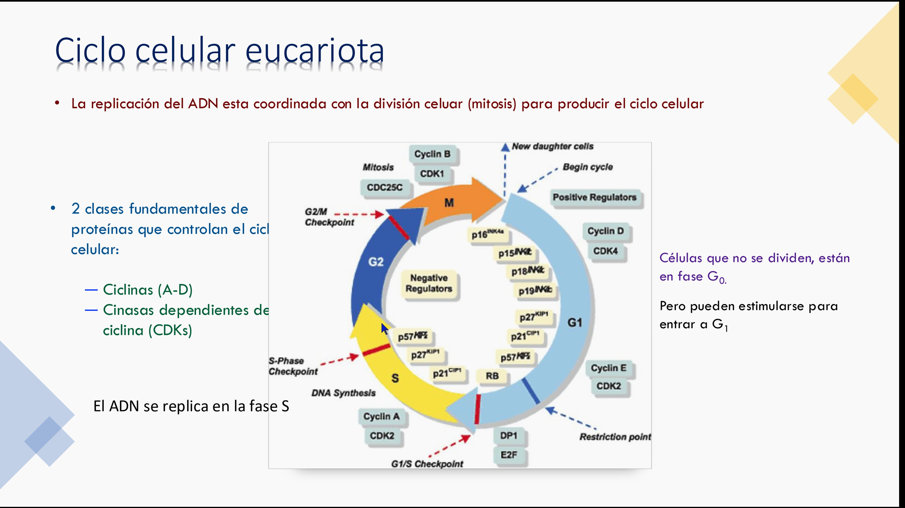
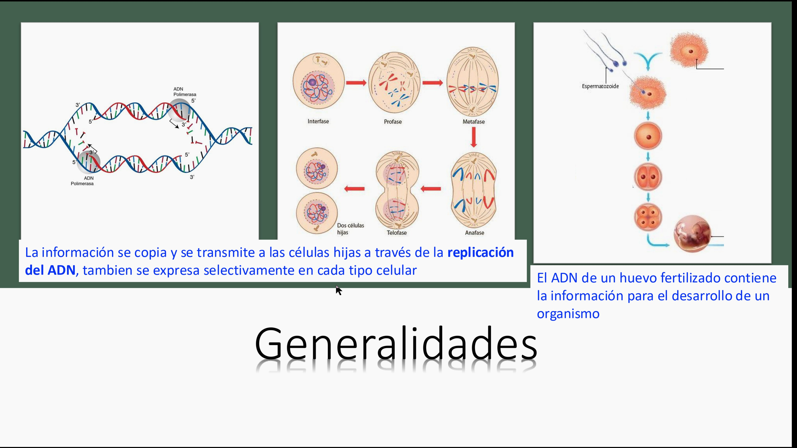

# Guía 1. Ciclo celular, mitosis y citocinesis

## Propósito

Explicar cómo una célula eucariota coordina su crecimiento, duplicación del ADN y división para producir células hijas genéticamente equivalentes.

## Objetivos

- Diferenciar las fases G1, S, G2 y M.
- Relacionar ciclinas, CDK y puntos de control con la progresión del ciclo.
- Ordenar las fases de la mitosis y distinguirlas de la citocinesis.
- Comparar la citocinesis en células animales, vegetales, hongos y bacterias.

## Ideas esenciales

El ciclo celular alterna una interfase, que incluye G1, S y G2, con la fase M. Durante S se replica el ADN; durante M se separan los cromosomas y se divide el citoplasma. G1 incluye crecimiento y preparación; G2 verifica que la célula tenga recursos y que la replicación se haya completado.

La transición entre fases depende de complejos ciclina-CDK. En el modelo animal, el punto de restricción de G1 regula el compromiso de proliferar en respuesta a señales de crecimiento; no es sinónimo del control de daño del ADN en G1/S. Los controles de daño y replicación incompleta y el control del huso mitótico pueden detener el avance. Son mecanismos de vigilancia, no una garantía absoluta contra errores.

En mitosis, la profase condensa la cromatina y organiza el huso; en prometafase se desintegra la envoltura nuclear y los microtúbulos contactan los cinetocoros; en metafase los cromosomas se alinean; en anafase se separan las cromátidas hermanas; en telofase se forman dos núcleos. La citocinesis separa físicamente las células hijas.

## Desarrollo y cuadro de repaso

| Fase | Evento | Estado del ADN de una célula diploide típica |
| --- | --- | --- |
| G1 | Crecimiento y decisión de proliferar | 2n, 2C |
| S | Duplicación del ADN | 2n; pasa de 2C a 4C |
| G2 | Preparación para mitosis | 2n, 4C |
| M | Separación de cromátidas y división | Cada célula hija termina con 2n, 2C |
| G0 | Salida del ciclo proliferativo | Mantiene funciones celulares |

**n** expresa juegos de cromosomas y **C** cantidad de ADN. La replicación duplica el ADN y las cromátidas; el número de cromosomas, contado por centrómeros, permanece igual antes de la separación. Durante anafase las cromátidas separadas pasan a considerarse cromosomas hijos.

En el modelo animal de las diapositivas, pRb limita la actividad de E2F. Las señales de crecimiento favorecen complejos ciclina-CDK que permiten expresar genes de la fase S. Ante daño, p53 puede estimular inhibidores de CDK, como p21, y detener el ciclo. Cdk1-ciclina B favorece la entrada a mitosis. APC/C marca securina y ciclinas mitóticas para su degradación: eliminar securina libera separasa, que corta cohesinas y permite separar cromátidas; degradar ciclinas contribuye a la salida de mitosis. La unión al huso y el control de APC/C coordinan este cambio irreversible.

| División | Mecanismo |
| --- | --- |
| Animal | Anillo de actina y miosina que produce un surco |
| Vegetal | Vesículas forman una placa celular mediante el fragmoplasto |
| Hongos | Septación o gemación según el organismo |
| Bacteriana | Fisión binaria con segregación del ADN y formación de un septo |

La fisión bacteriana no incluye mitosis. En plantas superiores, el huso puede organizarse sin los centrosomas con centriolos descritos para animales.

## Ejemplo conceptual

Una célula de un meristemo tiene 12 cromosomas en G1. Al terminar S conserva 12 cromosomas, ahora con 24 cromátidas. Tras mitosis y citocinesis, cada célula hija recibe 12 cromosomas. El crecimiento de raíces requiere coordinar división y diferenciación.

## Definiciones fundamentales

| Término | Significado operativo |
| --- | --- |
| Ciclo celular | Secuencia regulada de crecimiento, replicación del ADN y división celular |
| Interfase | Periodo formado por G1, S y G2, durante el cual la célula prepara su división |
| Mitosis | División nuclear que distribuye los cromosomas duplicados entre dos núcleos hijos |
| Citocinesis | Separación del citoplasma que forma las células hijas |
| Ciclina | Proteína reguladora cuya disponibilidad contribuye a controlar la actividad de las CDK |
| CDK | Quinasa dependiente de ciclina que fosforila proteínas implicadas en la progresión del ciclo |
| Cromátidas hermanas | Copias de un cromosoma producidas durante S |
| Centrómero | Región cromosómica donde se organiza el cinetocoro |
| Cinetocoro | Complejo proteico que conecta el cromosoma con el huso |
| Punto de control | Mecanismo que condiciona el avance a la correcta realización de un proceso |
| Fragmoplasto | Organización de microtúbulos y otros componentes que guía la placa celular |

## Preguntas y respuestas conceptuales

### 1. ¿En qué fase se duplica el ADN?

**Respuesta:** en S. La duplicación genera dos cromátidas hermanas por cromosoma, que posteriormente se separan durante la mitosis.

### 2. ¿La replicación del ADN duplica la ploidía?

**Respuesta:** no. En una célula diploide típica, G1 corresponde a 2n y 2C; después de S se conserva 2n, pero hay 4C de ADN. Se duplican las cromátidas, no los juegos de cromosomas.

### 3. ¿Qué diferencia existe entre ciclina y CDK?

**Respuesta:** la ciclina es una proteína reguladora; la CDK es la enzima que fosforila sustratos. La unión a ciclinas, las fosforilaciones y los inhibidores modulan la actividad de estos complejos.

### 4. ¿Qué función cumplen los puntos de control?

**Respuesta:** retrasan la progresión cuando hay problemas como daño del ADN, replicación incompleta o uniones incorrectas al huso. Permiten coordinar los eventos antes de avanzar.

### 5. ¿Qué diferencia hay entre metafase y anafase?

**Respuesta:** en metafase los cromosomas se alinean y mantienen unidas sus cromátidas hermanas. En anafase las cromátidas se separan y pasan a ser cromosomas hijos que se desplazan hacia polos opuestos.

### 6. ¿Qué comprueba el punto de control del huso?

**Respuesta:** supervisa la unión de los cromosomas al huso a través de sus cinetocoros antes de permitir la separación. Las uniones inadecuadas deben corregirse para evitar un reparto desigual.

### 7. ¿Por qué mitosis y citocinesis no son sinónimos?

**Respuesta:** la mitosis distribuye el material nuclear; la citocinesis divide el citoplasma. Son procesos coordinados, pero distintos, y puede ocurrir división nuclear sin separación celular inmediata.

### 8. ¿Cómo difiere la citocinesis vegetal de la animal?

**Respuesta:** en animales un anillo de actina y miosina produce un surco de segmentación. En plantas, vesículas guiadas por el fragmoplasto forman una placa celular que origina la separación entre las células hijas.

### 9. ¿La fisión binaria bacteriana incluye mitosis?

**Respuesta:** no. Las bacterias segregan su ADN y forman un septo sin realizar la mitosis eucariota ni utilizar un núcleo delimitado por envoltura.

### 10. ¿Qué relación tiene el ciclo celular con el crecimiento vegetal?

**Respuesta:** la división en meristemos aporta células nuevas. El crecimiento del órgano también depende de expansión y diferenciación; por eso, observar más células en mitosis no demuestra por sí solo mayor velocidad de crecimiento.

## Desarrollo para examen

### Secuencia de la mitosis

| Etapa | Evento distintivo | Diferencia que evita confusiones |
| --- | --- | --- |
| Profase | Condensación de cromosomas y organización del huso | El ADN ya fue duplicado durante S |
| Prometafase | En mitosis abierta se desorganiza la envoltura y el huso alcanza cinetocoros | No todos los eucariotas desmantelan la envoltura |
| Metafase | Alineación y biorientación hacia polos opuestos | Todavía no se separan las cromátidas |
| Anafase | Separación de hermanas y desplazamiento a polos | Cada cromátida separada cuenta como cromosoma hijo |
| Telofase | Reorganización nuclear y descondensación | Puede coincidir con la citocinesis |

**G0** es un estado no proliferativo, no una fase de duplicación. Algunas células quiescentes pueden volver al ciclo; otras permanecen diferenciadas y no vuelven normalmente. **Quiescencia** es una salida reversible; **senescencia celular** es una detención estable asociada con diversos tipos de estrés. No toda célula que deja de dividirse está muerta.

**Huso mitótico:** sistema de microtúbulos que organiza el reparto cromosómico. **Biorientación:** unión de los cinetocoros hermanos a polos opuestos. **Cohesina:** complejo que mantiene juntas las cromátidas. **Separasa:** proteasa que rompe esa cohesión. **Securina:** inhibidor de separasa. **APC/C:** complejo con actividad de ligasa de ubiquitina que favorece la degradación de reguladores específicos. **Fosforilación:** adición de un grupo fosfato que modifica la actividad de una proteína.

Las asociaciones ciclina D-CDK4/6, E-CDK2, A-CDK2 y B-CDK1 de la captura C49 pertenecen al esquema animal de estudio. Las plantas también utilizan ciclinas-CDK y reguladores relacionados con Rb/E2F, pero no debe trasladarse íntegramente la vía animal de p53 a ellas.

### 11. ¿G0 significa muerte celular?

**Respuesta:** no. La célula puede mantener metabolismo y funciones especializadas sin proliferar. Algunas células pueden reingresar al ciclo si reciben señales adecuadas.

### 12. ¿Qué diferencia hay entre punto de restricción y control de daño en G1/S?

**Respuesta:** el primero describe el compromiso proliferativo dependiente de señales de crecimiento en el modelo animal. El segundo detecta problemas del ADN que deben impedir su copia. Ambos influyen en G1, pero atienden decisiones distintas.

### 13. ¿Cómo participa APC/C en la anafase?

**Respuesta:** favorece la degradación de securina; separasa queda activa y corta cohesinas. Esto permite separar las cromátidas. La degradación de ciclinas mitóticas también contribuye a finalizar la fase M.

### 14. ¿Por qué es importante la biorientación?

**Respuesta:** permite dirigir una copia de cada cromosoma hacia cada polo. Uniones de ambas hermanas hacia el mismo polo pueden causar segregación desigual si no se corrigen.

### 15. ¿Cuántos cromosomas hay durante anafase en el ejemplo de 12?

**Respuesta:** una vez separadas las hermanas, hay transitoriamente 24 cromosomas hijos en la célula todavía no dividida, 12 destinados a cada polo. Después de la citocinesis cada hija tiene 12. No debe confundirse ese conteo transitorio con una nueva ploidía estable de las hijas.

### 16. ¿Qué diferencia conceptual existe entre mitosis y meiosis?

**Respuesta:** la mitosis normalmente conserva el número de juegos cromosómicos. La meiosis incluye dos divisiones tras una replicación y reduce la ploidía; en meiosis I se separan homólogos y en II, hermanas. Esta comparación es contextual: las referencias del conjunto desarrollan principalmente mitosis.

### 17. ¿Cómo difiere la división de hongos de la bacteriana?

**Respuesta:** los hongos son eucariotas y realizan segregación nuclear mitótica, con citocinesis por mecanismos como septación o gemación según la especie. Las bacterias realizan fisión sin núcleo ni mitosis eucariota.

### 18. ¿Una célula detenida en metafase demuestra más proliferación?

**Respuesta:** no. La acumulación de células mitóticas puede indicar que tardan más en terminar o que están bloqueadas. Proliferación implica completar divisiones y producir células nuevas.

## Capturas de las referencias

Las imágenes conservan su archivo original. Amplía cada captura para revisar sus rótulos. Las aclaraciones de esta guía prevalecen sobre las erratas señaladas.

### Captura C49. Ciclo celular y ciclinas-CDK

### Captura C69. Replicación y transmisión celular

[Volver al índice](guias-biologia-celular.md) · [Catálogo de capturas](capturas-referencias.md)
