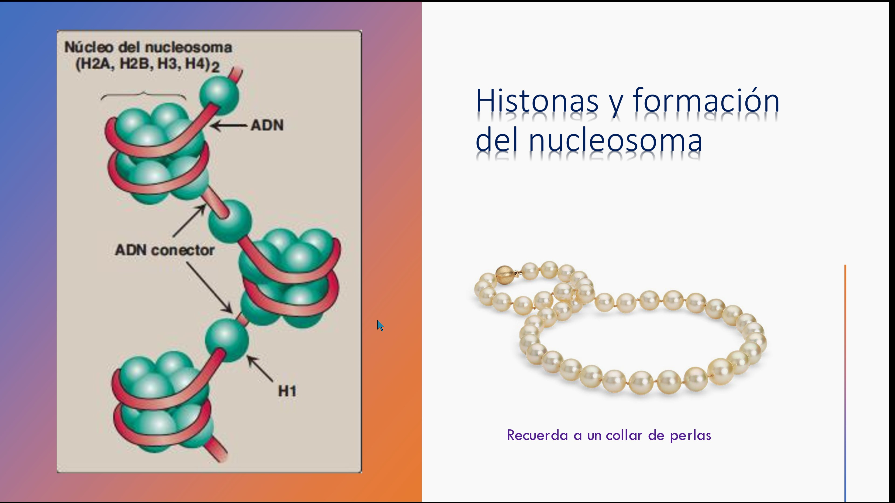
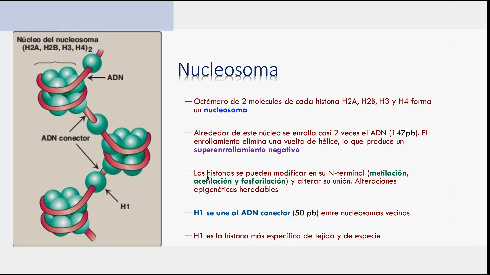
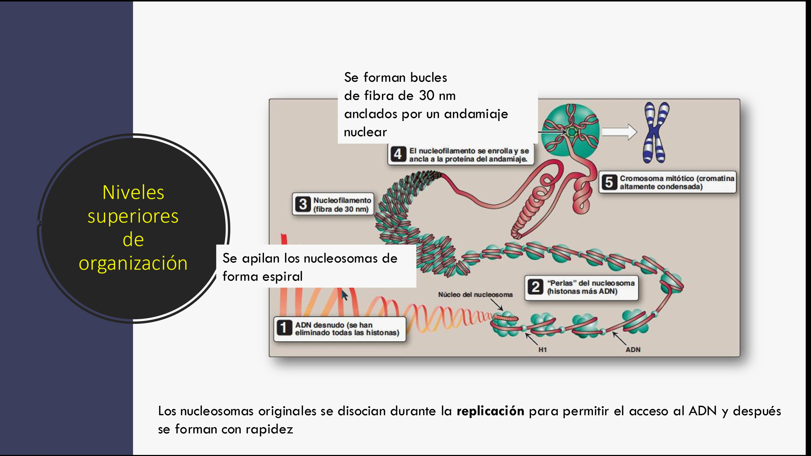
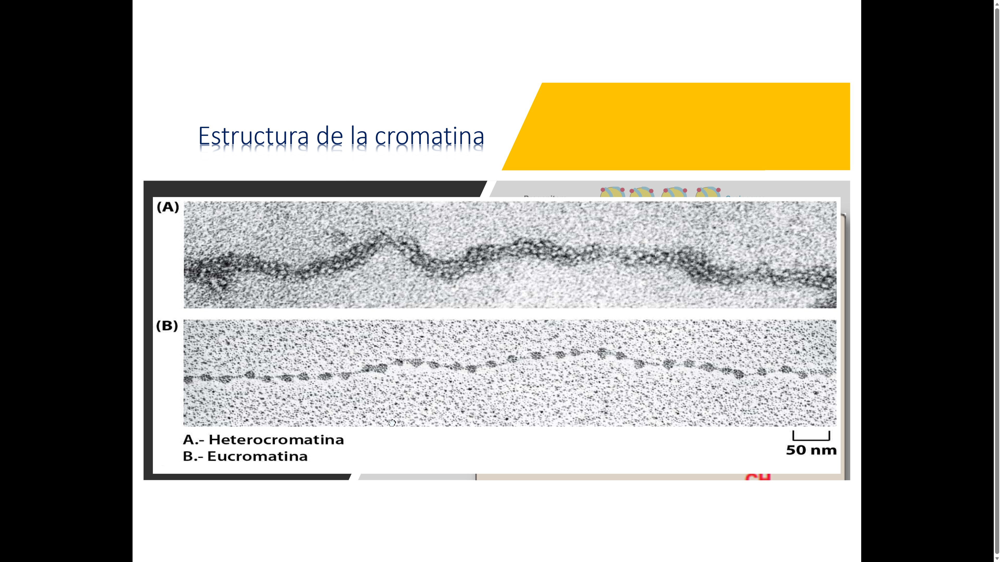
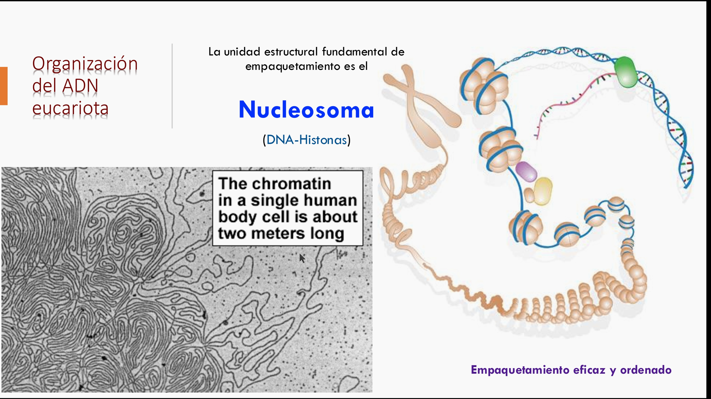

# Guía 2. Núcleo celular y complejo del poro nuclear

## Propósito

Reconocer al núcleo como compartimento que protege el genoma y regula el intercambio de información entre núcleo y citoplasma.

## Objetivos

- Identificar envoltura nuclear, lámina nuclear, nucleoplasma, cromatina y nucléolo.
- Explicar la función del complejo del poro nuclear.
- Relacionar transporte nuclear, organización de la cromatina y control del ciclo celular.

## Ideas esenciales

La envoltura nuclear tiene dos membranas; la externa es continua con el retículo endoplásmico y el espacio perinuclear se comunica con su lumen. En animales, la lámina nuclear aporta soporte y participa en la organización de cromatina; las plantas poseen proteínas de soporte distintas de las láminas animales clásicas. El nucléolo participa en producción y procesamiento de ARN ribosómico y ensamblaje de subunidades ribosómicas.

El complejo del poro nuclear controla el intercambio selectivo entre núcleo y citoplasma. Algunas moléculas pequeñas pueden difundirse; muchas macromoléculas requieren receptores y señales. Las importinas y exportinas transportan numerosas proteínas; Ran contribuye a su direccionalidad. La exportación de ARNm utiliza principalmente una vía diferente, explicada abajo.

La cromatina no es uniforme: la eucromatina suele estar más accesible para la expresión génica y la heterocromatina más compactada. La posición y el grado de compactación de la cromatina influyen en la replicación, la reparación y la transcripción.

## Estructuras y funciones

| Estructura | Función que debes explicar |
| --- | --- |
| Envoltura nuclear | Delimita el compartimento nuclear |
| Poro nuclear | Permite intercambio selectivo |
| Lámina nuclear | Soporte y organización en el modelo animal |
| Cromatina | Empaqueta y regula el acceso al ADN |
| Nucléolo | Síntesis y procesamiento de ARNr y ensamblaje de subunidades |

El nucleosoma contiene ADN enrollado alrededor de un octámero: dos copias de H2A, H2B, H3 y H4. H1 se asocia al ADN de enlace; no pertenece al octámero. La compactación afecta la disponibilidad de ADN para replicación y transcripción. La fibra de 30 nm de las capturas es un modelo clásico de empaquetamiento, no una arquitectura universal obligatoria.

Una proteína nuclear se sintetiza en el citoplasma, presenta una señal de localización nuclear y se une a receptores de importación. Estos atraviesan el poro y liberan la carga en el núcleo. El gradiente de Ran ayuda a dirigir el transporte de muchas proteínas; la exportación de ARNm utiliza mecanismos propios y no debe atribuirse toda al mismo sistema Ran.

## Ejemplo conceptual

Dos células vegetales contienen el mismo gen, pero producen cantidades distintas de su ARN. Una explicación posible es diferente accesibilidad de cromatina o actividad de factores de transcripción. Compartir el genoma no obliga a expresar todos los genes por igual.

## Definiciones fundamentales

| Término | Significado operativo |
| --- | --- |
| Núcleo | Compartimento eucariota que contiene la mayor parte del genoma y organiza su utilización |
| Envoltura nuclear | Doble membrana que delimita el núcleo y es continua con el retículo endoplásmico |
| Complejo del poro nuclear | Ensamblaje proteico que regula el intercambio entre núcleo y citoplasma |
| Lámina nuclear | Red de soporte bajo la membrana interna en el modelo animal |
| Nucleoplasma | Medio interno del núcleo donde se encuentran cromatina y otros componentes |
| Cromatina | ADN asociado con histonas y otras proteínas |
| Nucleosoma | Unidad de empaquetamiento formada por ADN y un octámero de histonas |
| Eucromatina | Cromatina relativamente accesible, frecuentemente asociada con actividad transcripcional |
| Heterocromatina | Cromatina más compactada, generalmente menos accesible |
| Nucléolo | Región nuclear de producción y procesamiento de ARNr y ensamblaje ribosómico |
| Señal de localización nuclear | Secuencia reconocida por la maquinaria de importación de proteínas |

## Preguntas y respuestas conceptuales

### 1. ¿Qué diferencia hay entre envoltura y poro nuclear?

**Respuesta:** la envoltura es la doble membrana que delimita el núcleo. El poro es un complejo proteico que atraviesa la envoltura y controla el intercambio.

### 2. ¿Qué función cumple el nucléolo?

**Respuesta:** participa en la síntesis y procesamiento de ARN ribosómico y en el ensamblaje de las subunidades ribosómicas. No está delimitado por una membrana propia.

### 3. ¿Qué diferencia hay entre nucléolo y nucleosoma?

**Respuesta:** el nucléolo es una región funcional del núcleo relacionada con ribosomas. El nucleosoma es una unidad molecular de empaquetamiento del ADN alrededor de histonas.

### 4. ¿Cuáles histonas forman el octámero del nucleosoma?

**Respuesta:** dos copias de H2A, H2B, H3 y H4. H1 se asocia al ADN de enlace, pero no integra ese octámero.

### 5. ¿Cómo influye la cromatina en la expresión génica?

**Respuesta:** su organización puede facilitar o limitar el acceso de factores reguladores y polimerasas al ADN. La accesibilidad influye en la expresión, pero no basta por sí sola para activar un gen.

### 6. ¿Cómo entra una proteína destinada al núcleo?

**Respuesta:** muchas proteínas presentan una señal de localización nuclear reconocida por importinas. El complejo atraviesa el poro y libera la carga en el núcleo; Ran contribuye a la direccionalidad de este transporte.

### 7. ¿Qué diferencia existe entre difusión y transporte mediado?

**Respuesta:** algunas moléculas pequeñas pueden atravesar el poro por difusión. Muchas macromoléculas requieren receptores y señales que permiten seleccionar la carga y dirigir su desplazamiento.

### 8. ¿Toda exportación de ARN depende de Ran?

**Respuesta:** no. El transporte de muchas proteínas utiliza Ran, pero la exportación de ARNm emplea principalmente mecanismos propios. No se deben atribuir todos los intercambios nucleares a una única vía.

### 9. ¿Por qué el núcleo regula funciones si las proteínas se sintetizan fuera de él?

**Respuesta:** controla la disponibilidad y el procesamiento de los ARN que contienen o regulan la información. Los ribosomas traducen los ARNm y las proteínas resultantes ejecutan muchas funciones celulares.

### 10. ¿Dos células vegetales con el mismo genoma expresan los mismos genes?

**Respuesta:** no necesariamente. La accesibilidad de la cromatina, los factores de transcripción y las señales celulares pueden originar patrones distintos de expresión en raíz, hoja y otros tejidos.

## Desarrollo para examen

### Transporte nuclear paso a paso

**Nucleoporinas** son las proteínas del poro. Muchas contienen regiones repetidas FG que forman una barrera selectiva y permiten interacciones transitorias con receptores. Una **NLS** es una señal de localización nuclear; una **NES**, una señal de exportación. **Ran** es una GTPasa: alterna entre formas unidas a GTP y GDP. **Ran-GEF**, predominantemente nuclear y asociada con cromatina, favorece Ran-GTP; **Ran-GAP**, citoplasmática, favorece la hidrólisis a Ran-GDP.

| Proceso | En el compartimento de origen | En el de destino |
| --- | --- | --- |
| Importación clásica de proteína | La carga con NLS se une al receptor en citoplasma | Ran-GTP se une al receptor y favorece liberar la carga en núcleo |
| Exportación de proteína | Carga con NES, exportina y Ran-GTP forman un complejo nuclear | Hidrólisis de GTP favorece su desensamblaje en citoplasma |
| Exportación de ARNm | El ARN procesado forma una partícula con proteínas y receptores de exportación | Remodelación de la partícula favorece liberación y evita retorno; no usa principalmente el ciclo Ran de las proteínas |

La hidrólisis de GTP y el mantenimiento del gradiente sostienen la direccionalidad; Ran no es un motor que empuje físicamente todas las cargas. Las proteínas nucleares se sintetizan en ribosomas citoplasmáticos y muchas cruzan el poro ya plegadas.

### Organización y función del genoma

Un **gen** es una región de ADN cuya expresión origina un producto funcional de ARN o proteína. Un **genoma** es el conjunto de información genética de un organismo; en plantas incluye genomas nuclear, mitocondrial y plastidial. Un **cromosoma** es una unidad organizada de ADN y proteínas; no tiene forma de X durante todo el ciclo. La X representa un cromosoma duplicado y condensado.

Cada nucleosoma central contiene aproximadamente 147 pares de bases alrededor del octámero. Las colas de histonas pueden modificarse por acetilación, metilación y fosforilación. Estas marcas pueden modificar interacciones y reclutar proteínas, pero su efecto depende de la posición y del contexto; no toda metilación reprime ni toda marca es necesariamente heredable. **Epigenética** estudia estados de regulación que no se explican por cambios en la secuencia del ADN. Los nucleosomas se reorganizan durante replicación y transcripción.

### 11. ¿Por qué Ran-GTP es más abundante en el núcleo?

**Respuesta:** Ran-GEF favorece allí el intercambio de GDP por GTP, mientras Ran-GAP promueve hidrólisis en el citoplasma. La distribución de estos reguladores mantiene estados distintos a ambos lados del poro.

### 12. ¿Por qué importación y exportación responden de forma diferente a Ran-GTP?

**Respuesta:** Ran-GTP favorece la liberación de carga desde muchas importinas, pero estabiliza el complejo carga-exportina en el núcleo. La hidrólisis citoplasmática desarma el complejo exportador.

### 13. ¿El núcleo contiene todo el ADN de una planta?

**Respuesta:** no. Mitocondrias y plastidios también contienen ADN. El genoma nuclear codifica muchas proteínas necesarias para esos organelos, que deben importarse después de su síntesis.

### 14. ¿Un cromosoma siempre tiene dos cromátidas?

**Respuesta:** no. Antes de replicar, tiene una molécula de ADN de doble hebra. Después de S, presenta dos cromátidas hermanas, cada una con una doble hélice. Cromátida y hebra de ADN no son sinónimos.

### 15. ¿Heterocromatina equivale a ADN inútil?

**Respuesta:** no. Participa en organización, estabilidad y regulación del genoma. Su menor accesibilidad no implica ausencia de función ni una prohibición absoluta de transcripción.

### 16. ¿Qué relación tiene el nucléolo con los ribosomas citoplasmáticos?

**Respuesta:** procesa ARNr y ensambla subunidades con proteínas ribosómicas importadas. Las subunidades se exportan por separado y participan posteriormente en traducción; el nucléolo no fabrica directamente todas las proteínas.

### 17. ¿La fibra de 30 nm aparece obligatoriamente en toda cromatina?

**Respuesta:** no. Es un modelo clásico que organiza niveles de empaquetamiento; la cromatina celular puede adoptar configuraciones más heterogéneas. Debe comprenderse el principio de compactación sin convertir el dibujo en una regla universal.

### 18. ¿Una marca de histona cambia la secuencia del ADN?

**Respuesta:** no por sí misma. Modifica la regulación o las interacciones de cromatina. Una mutación, en cambio, modifica la secuencia; ambos procesos pueden influir en expresión por mecanismos distintos.

## Capturas de las referencias

Las imágenes conservan su archivo original. Amplía cada captura para revisar sus rótulos. Las aclaraciones de esta guía prevalecen sobre las erratas señaladas.

### Captura C02. Histonas y formación del nucleosoma

### Captura C34. Composición del nucleosoma

### Captura C52. Niveles de compactación de cromatina

### Captura C71. Eucromatina y heterocromatina

### Captura C75. Organización del ADN eucariota

[Volver al índice](guias-biologia-celular.md) · [Catálogo de capturas](capturas-referencias.md)
