# Guía 4. Daño y reparación del ADN

## Propósito

Relacionar los agentes que lesionan el ADN con los mecanismos celulares que detectan, corrigen o toleran esas lesiones.

## Objetivos

- Diferenciar daño, lesión, mutación y reparación.
- Clasificar mutágenos físicos, químicos y biológicos.
- Explicar el desapareamiento de bases y la reparación de errores de replicación.
- Analizar las consecuencias de reparar de forma incompleta o incorrecta.

## Ideas esenciales

El ADN puede dañarse por radiación, sustancias químicas, especies reactivas y errores espontáneos de replicación. Una lesión es una alteración estructural o química; una mutación es un cambio estable en la secuencia que permanece después de la replicación.

Durante la replicación pueden aparecer bases mal apareadas o pequeños bucles de inserción y deleción. La reparación de desapareamientos (MMR) reconoce la distorsión, identifica la hebra recién sintetizada, elimina el tramo defectuoso, resintetiza y sella el ADN.

La reparación debe restaurar la información sin introducir nuevos errores. Si el daño bloquea la replicación o se copia antes de corregirse, puede producir sustituciones, inserciones, deleciones o reordenamientos. El resultado puede ser neutro, perjudicial o, en algunos contextos, ventajoso.

## Comparación de mecanismos

| Sistema | Problema principal | Reparación general |
| --- | --- | --- |
| Revisión de polimerasa | Nucleótido recién incorporado incorrecto | Exonucleasa correctora y nueva síntesis |
| MMR | Bases mal apareadas y pequeños bucles | Retira un tramo de la hebra nueva y lo reemplaza |
| BER | Bases alteradas o sitios sin base | Glucosilasa, procesamiento del sitio AP, síntesis y ligación |
| NER | Lesiones voluminosas, como dímeros por UV | Retira un oligonucleótido lesionado y rellena |
| Recombinación homóloga | Rotura de doble cadena | Usa ADN homólogo como molde, habitualmente cromátida hermana |
| NHEJ | Rotura de doble cadena | Procesa y une extremos sin requerir un molde homólogo |

BER empieza retirando una base, mientras NER retira un tramo de nucleótidos. NHEJ puede perder o incorporar nucleótidos cuando requiere procesar extremos. La reparación homóloga resulta especialmente útil cuando existe una cromátida hermana disponible.

| Agente o proceso | Lesión posible |
| --- | --- |
| Radiación UV | Dímeros de pirimidinas |
| Radiación ionizante | Roturas de cadenas |
| Agentes alquilantes | Bases químicamente modificadas |
| Agentes intercalantes | Errores de inserción o deleción durante copia |
| Desaminación espontánea | Conversión de citosina en uracilo |

La distinción entre hebra nueva y parental por metilación GATC corresponde al modelo bacteriano de las capturas. En eucariotas intervienen discontinuidades y señales asociadas a la replicación. Si el daño es grave, la célula puede detener el ciclo o activar muerte celular.

## Ejemplo conceptual

Una base C se transforma en U. Es una lesión que puede retirar BER. Si la célula la copia sin corregirla, U puede dirigir incorporación de A y fijar un cambio de secuencia en una molécula descendiente. La lesión inicial y la mutación estable son etapas distintas.

## Definiciones fundamentales

| Término | Significado operativo |
| --- | --- |
| Lesión | Alteración química o estructural del ADN |
| Mutación | Cambio estable de secuencia; no toda lesión llega a fijarlo |
| Mutágeno | Agente que aumenta la frecuencia de mutaciones |
| MMR | Reparación de bases mal apareadas y pequeños bucles asociados con errores de copia |
| BER | Reparación por escisión de bases alteradas y procesamiento de sitios sin base |
| NER | Reparación por escisión de un tramo de ADN que contiene una lesión voluminosa |
| Sitio AP | Posición del ADN sin base púrica o pirimídica |
| Desaminación | Pérdida de un grupo amino de una base |
| Aducto | Producto de la unión covalente de una sustancia al ADN |
| Reparación homóloga | Restauración de una rotura utilizando una secuencia homóloga como molde |
| NHEJ | Unión de extremos de una rotura de doble cadena sin requerir un molde homólogo |

## Preguntas y respuestas conceptuales

### 1. ¿Toda lesión del ADN es una mutación?

**Respuesta:** no. Una lesión puede repararse antes de fijar un cambio de secuencia. Lesión describe daño molecular; mutación describe un cambio estable.

### 2. ¿Qué errores corrige MMR?

**Respuesta:** principalmente bases mal apareadas y pequeños bucles de inserción o deleción producidos durante la replicación y que escaparon de la revisión de la polimerasa.

### 3. ¿Por qué MMR distingue la hebra nueva de la parental?

**Respuesta:** debe corregir la copia defectuosa conservando la información del molde. Corregir la hebra equivocada puede fijar un cambio en vez de restaurar la secuencia original.

### 4. ¿Qué diferencia existe entre BER y NER?

**Respuesta:** BER comienza con la eliminación de una base alterada por una glucosilasa y el procesamiento del sitio AP. NER elimina un oligonucleótido que contiene una lesión voluminosa. Ambos requieren completar la reparación mediante síntesis y ligación.

### 5. ¿Cómo se repara una citosina transformada en uracilo?

**Respuesta:** BER puede reconocer y eliminar el uracilo, procesar el sitio sin base y restaurar el ADN utilizando la hebra complementaria como referencia.

### 6. ¿Qué lesiones puede producir la radiación UV?

**Respuesta:** puede generar fotoproductos entre pirimidinas adyacentes, incluidos dímeros. Estas lesiones pueden deformar el ADN e interferir con su replicación o transcripción.

### 7. ¿Cómo difieren reparación homóloga y NHEJ?

**Respuesta:** la reparación homóloga utiliza una secuencia homóloga como molde, con frecuencia la cromátida hermana. NHEJ une extremos sin ese molde; si requiere procesarlos, puede perder o incorporar nucleótidos, aunque no toda unión es necesariamente errónea.

### 8. ¿Por qué la fase del ciclo influye en la reparación de roturas?

**Respuesta:** después de replicar el ADN existe una cromátida hermana que puede servir como molde. Su disponibilidad favorece determinadas formas de reparación homóloga.

### 9. ¿Qué puede ocurrir cuando el daño no se repara?

**Respuesta:** la célula puede detener el ciclo, tolerar la lesión, acumular cambios de secuencia o activar muerte celular. El resultado depende de la lesión, su magnitud y la respuesta celular.

### 10. ¿Toda mutación es perjudicial?

**Respuesta:** no. Su efecto puede ser neutro, perjudicial o beneficioso en un contexto determinado. Una mutación en un regulador del ciclo, por ejemplo, puede favorecer proliferación descontrolada, pero no todas las mutaciones afectan esa función.

## Desarrollo para examen

### Clasificación de causas y consecuencias

| Categoría | Ejemplo | Efecto posible |
| --- | --- | --- |
| Física | UV | Fotoproductos entre pirimidinas vecinas |
| Física | Radiación ionizante | Radicales y roturas mono o bicatenarias |
| Química | Alquilantes | Modificación de bases y posibles apareamientos anómalos |
| Química | Intercalantes | Distorsión y errores de inserción/deleción |
| Biológica | Inserción de elementos móviles o ciertos genomas virales | Interrupción de genes o cambios de regulación |
| Endógena | Desaminación, despurinación, especies reactivas de oxígeno | Bases alteradas, sitios AP y otras lesiones |

La categoría biológica es una ampliación explicativa del objetivo: no todos los virus se integran ni toda infección es mutagénica. Una aflatoxina producida por un hongo se clasifica como agente químico por su mecanismo, aunque tenga origen biológico. **Mutagenicidad** es capacidad de aumentar cambios de secuencia; **carcinogenicidad**, de favorecer cáncer. No son términos equivalentes, y los ejemplos clínicos humanos no describen automáticamente enfermedad vegetal.

### Mecanismos en secuencia

**MMR:** reconocimiento del desapareamiento por complejos como MutS/MutL en el modelo bacteriano o sus homólogos eucariotas; selección de la hebra nueva; corte y eliminación del segmento; síntesis usando la hebra parental; ligación. La metilación Dam y MutH corresponden a E. coli y bacterias relacionadas, no a todo MMR bacteriano.

**BER:** una glucosilasa elimina una base alterada; queda un sitio AP; una endonucleasa AP y otras enzimas procesan el esqueleto; se incorpora ADN correcto; ligasa sella. Si el sitio AP ya existía por pérdida espontánea de base, no hace falta crear otro retirando una base. **NER:** reconocimiento de una distorsión; apertura local; cortes a ambos lados en la hebra lesionada; retiro de un oligonucleótido; síntesis y ligación. NER no elimina la doble hélice completa.

**Recombinación homóloga:** procesamiento de extremos para generar regiones monocatenarias; búsqueda e invasión de un molde homólogo, con proteínas como RAD51; síntesis guiada por ese molde; resolución y unión. **NHEJ:** reconocimiento de extremos, frecuentemente por Ku; aproximación, procesamiento cuando sea necesario y ligación. Los detalles proteicos de las figuras son principalmente mamíferos. NHEJ no es siempre mutagénica y recombinación homóloga no exige necesariamente el cromosoma homólogo de origen materno o paterno: puede usar la hermana.

Una C desaminada produce U y puede acabar fijando una transición C:G a T:A si no se repara. La desaminación de adenina genera hipoxantina; la de guanina, xantina, cuyos efectos no se resumen de forma universal como G a A. Las afirmaciones de C20 y las cifras por célula de C33/C50 requieren contexto y no deben memorizarse como reglas para todo organismo.

### 11. ¿Cómo se distinguen daño espontáneo y agente externo?

**Respuesta:** un daño espontáneo puede originarse por reacciones químicas normales del ADN o por metabolismo celular. Un agente externo, como UV o un compuesto alquilante, añade una exposición. Ambas categorías pueden activar reparación.

### 12. ¿Qué diferencia hay entre mutágeno y carcinógeno?

**Respuesta:** el mutágeno aumenta mutaciones; el carcinógeno favorece cáncer por mecanismos que pueden incluir mutación, pero no se limitan a ella. No toda mutación produce cáncer.

### 13. ¿Qué ocurre si la célula copia uracilo antes de repararlo?

**Respuesta:** U puede orientar incorporación de A. En generaciones de copia posteriores puede establecerse T:A donde había C:G. La lesión y la fijación del cambio deben distinguirse temporalmente.

### 14. ¿Por qué revisión de polimerasa y MMR no son idénticos?

**Respuesta:** la revisión elimina el nucleótido terminal incorrecto durante síntesis. MMR reconoce errores que escaparon y reemplaza un segmento de la hebra nueva. C17 mezcla ambos en su ilustración; se deben estudiar separados.

### 15. ¿BER y NER eliminan la misma unidad?

**Respuesta:** no. BER inicia eliminando una base o procesando un sitio AP; NER retira un oligonucleótido con la lesión. Después ambos restauran la continuidad e información del ADN.

### 16. ¿Qué ventaja aporta usar una cromátida hermana como molde?

**Respuesta:** ofrece una secuencia muy similar para recuperar información perdida en una rotura. Por eso la reparación homóloga suele favorecerse en S/G2, cuando la hermana está disponible.

### 17. ¿Tolerar una lesión equivale a repararla?

**Respuesta:** no. La síntesis translesión puede permitir pasar una lesión que bloquea la copia sin retirarla inmediatamente y puede introducir errores. Reparación restaura el ADN; tolerancia permite continuar pese al daño.

### 18. ¿Qué diferencia existe entre protooncogén y oncogén?

**Respuesta:** en el modelo animal, un protooncogén normal participa en señales de crecimiento o supervivencia. Ciertas alteraciones activadoras pueden convertirlo en oncogén. No necesita estar previamente mutado para llamarse protooncogén.

### 19. ¿Cómo actúa la célula ante daño grave?

**Respuesta:** puede activar controles que detienen el ciclo, reparación y, según contexto, senescencia o muerte celular programada. Apoptosis es el modelo animal de las referencias; la muerte programada vegetal comparte funciones generales, no toda su maquinaria.

### 20. ¿Qué relación tienen UV y reparación en plantas?

**Respuesta:** NER puede retirar fotoproductos. Como contexto vegetal adicional, muchas plantas tienen fotoliasas que revierten directamente determinados fotoproductos usando luz. Por ello no todo cambio en sensibilidad a UV demuestra un defecto exclusivo de NER.

## Capturas de las referencias

Las imágenes conservan su archivo original. Amplía cada captura para revisar sus rótulos. Las aclaraciones de esta guía prevalecen sobre las erratas señaladas.

### Captura C06. Comparación de sistemas de reparación

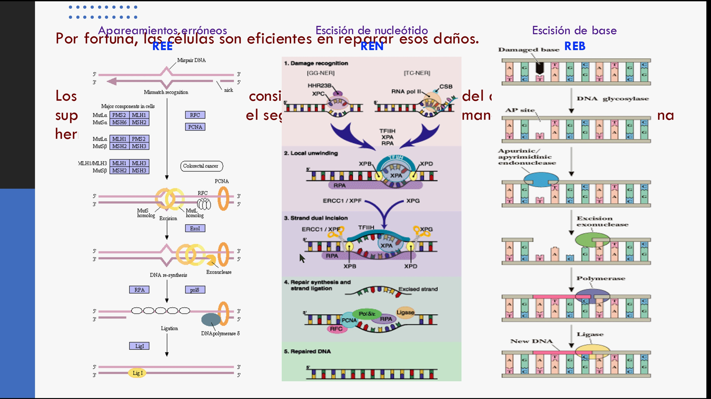

### Captura C07. MMR bacteriano y metilación

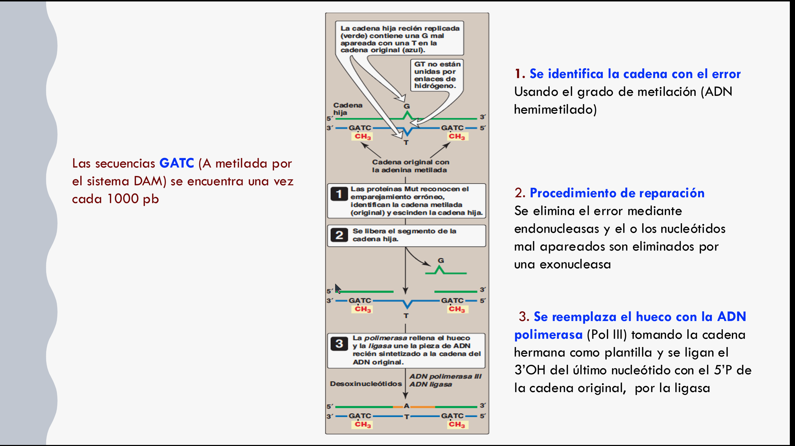

### Captura C13. Portada: reparación del ADN

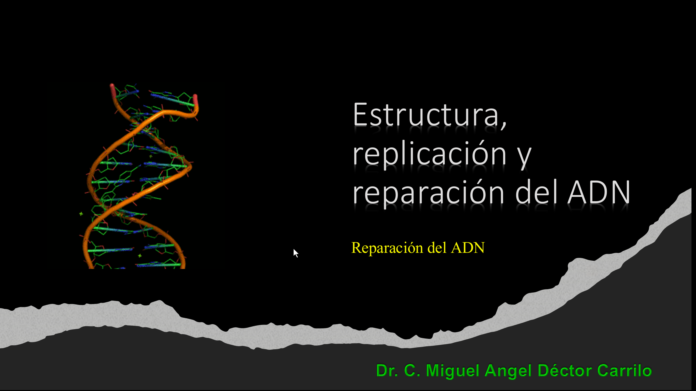

### Captura C17. Reparación de apareamientos erróneos

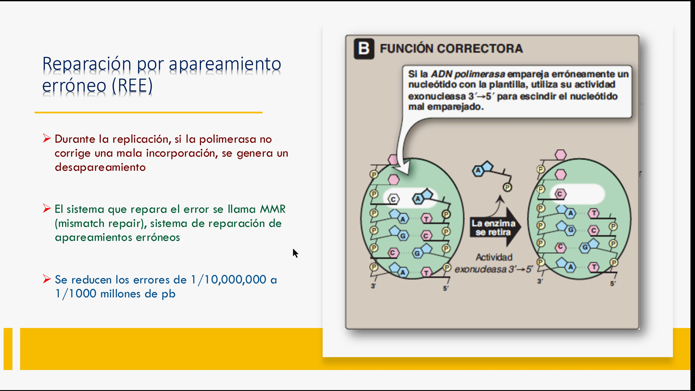

### Captura C19. Portada: reparación

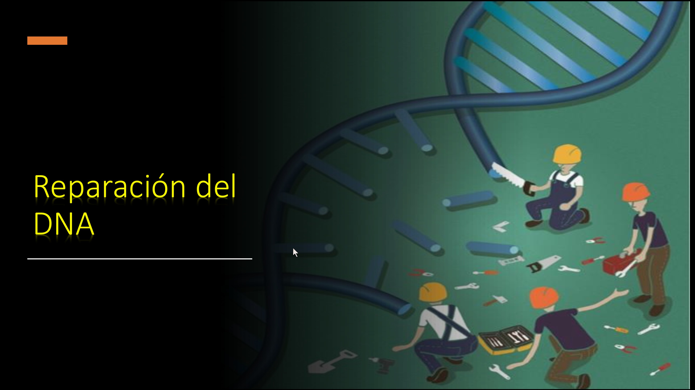

### Captura C20. Desaminación de bases

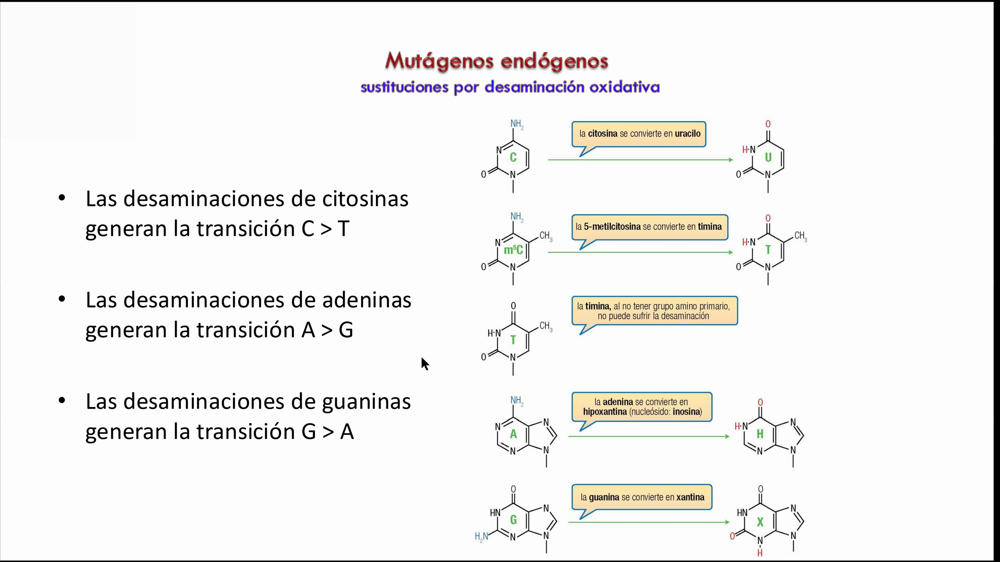

### Captura C28. Reparación de roturas de doble cadena

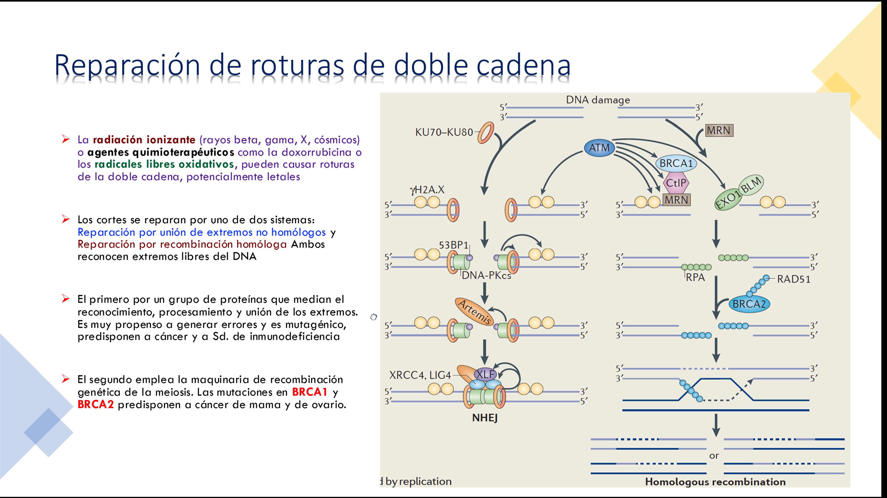

### Captura C30. Fotografías introductorias sin contenido molecular

### Captura C33. Reparación por escisión de bases

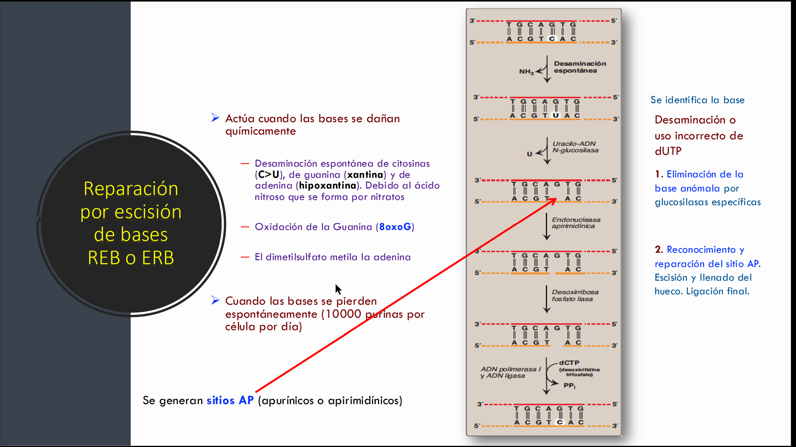

### Captura C36. Resumen de reparación del ADN

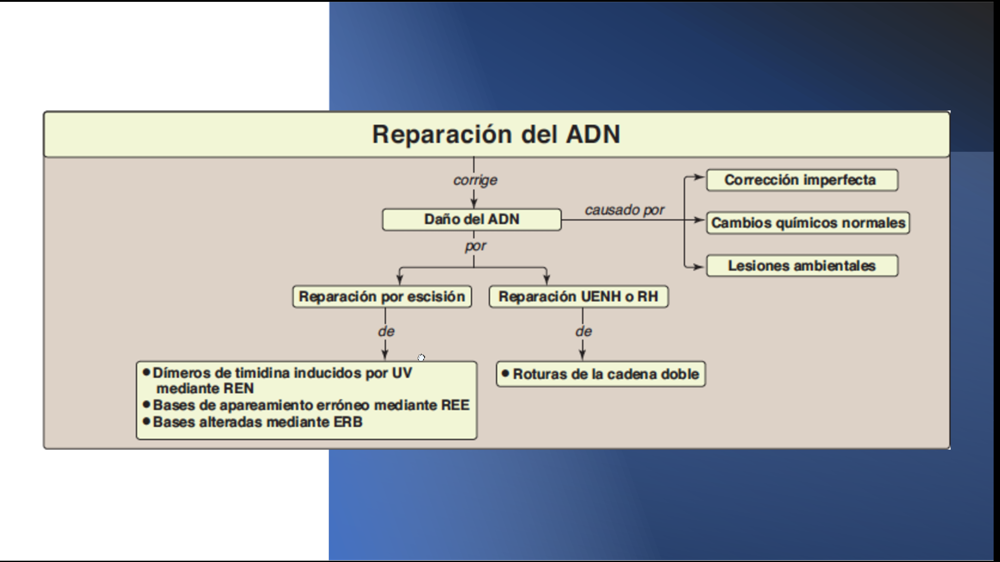

### Captura C39. Ilustración introductoria de reparación

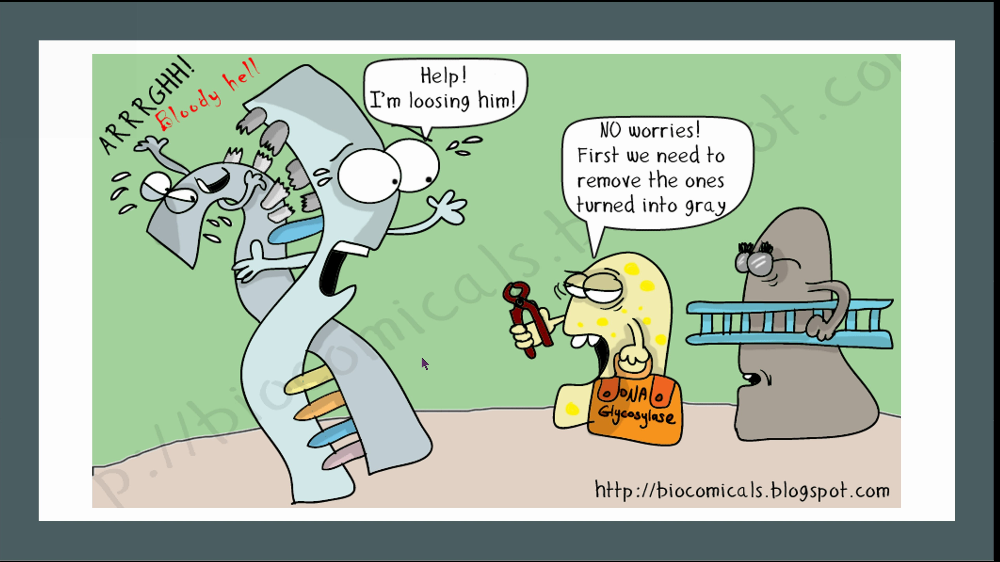

### Captura C50. Pérdida o alteración espontánea de bases

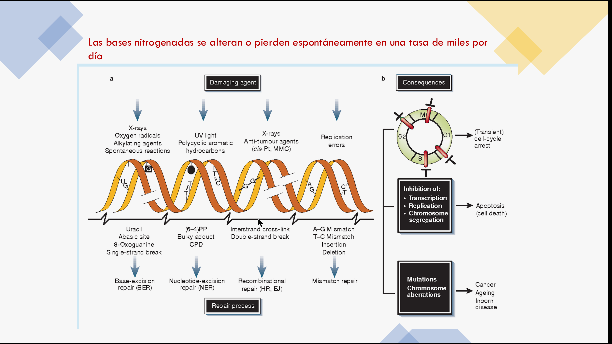

### Captura C54. MMR: genes de reparación

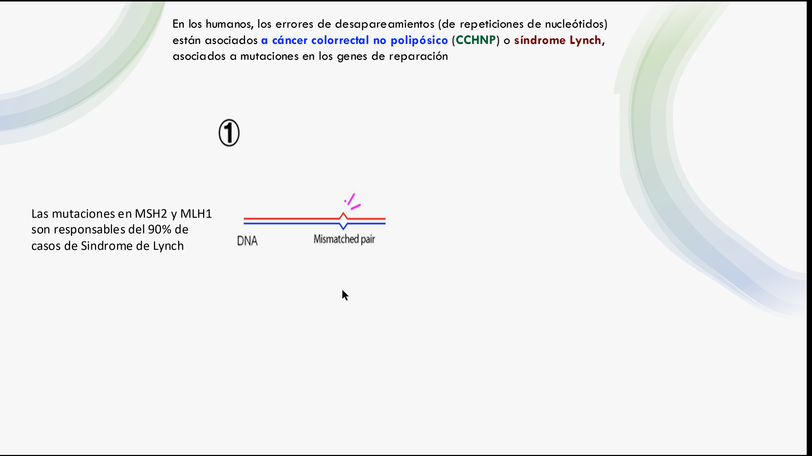

### Captura C56. Reparación por escisión de nucleótidos

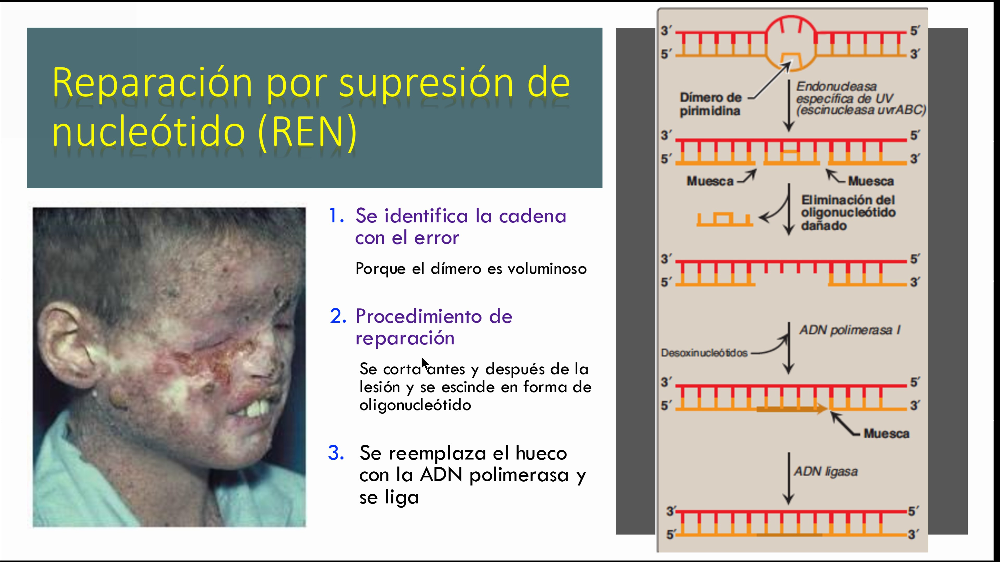

### Captura C63. Daño, reparación y mutación

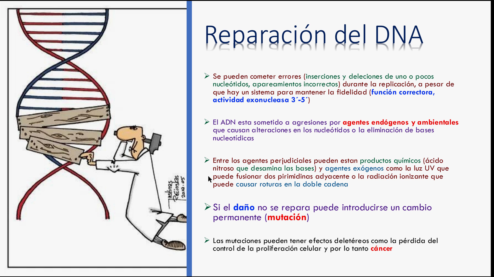

### Captura C64. Escisión de ADN lesionado

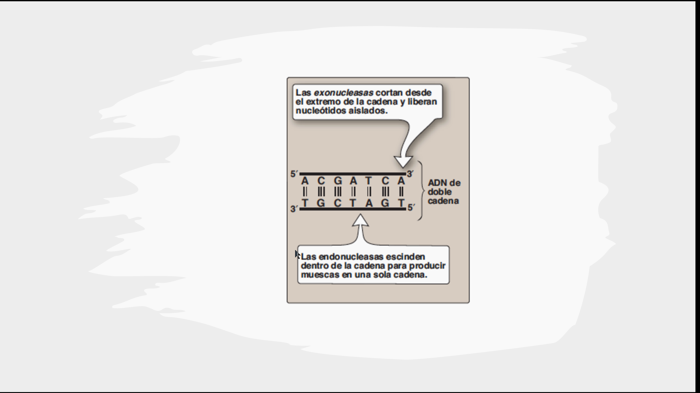

### Captura C65. Metabolismo de análogos de nucleósidos

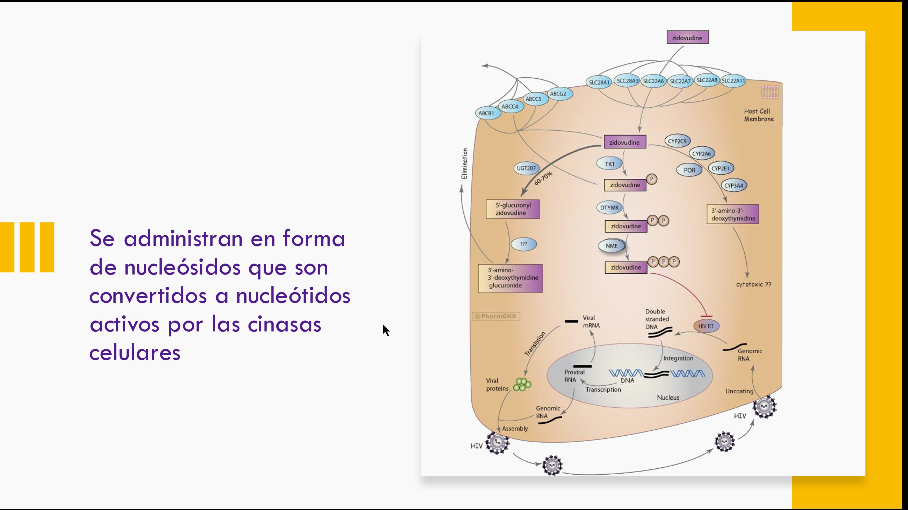

[Volver al índice](guias-biologia-celular.md) · [Catálogo de capturas](capturas-referencias.md)
