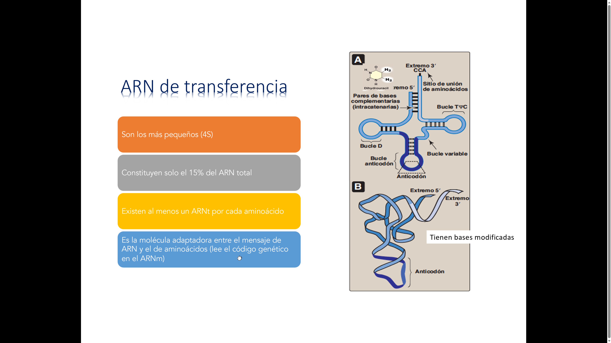
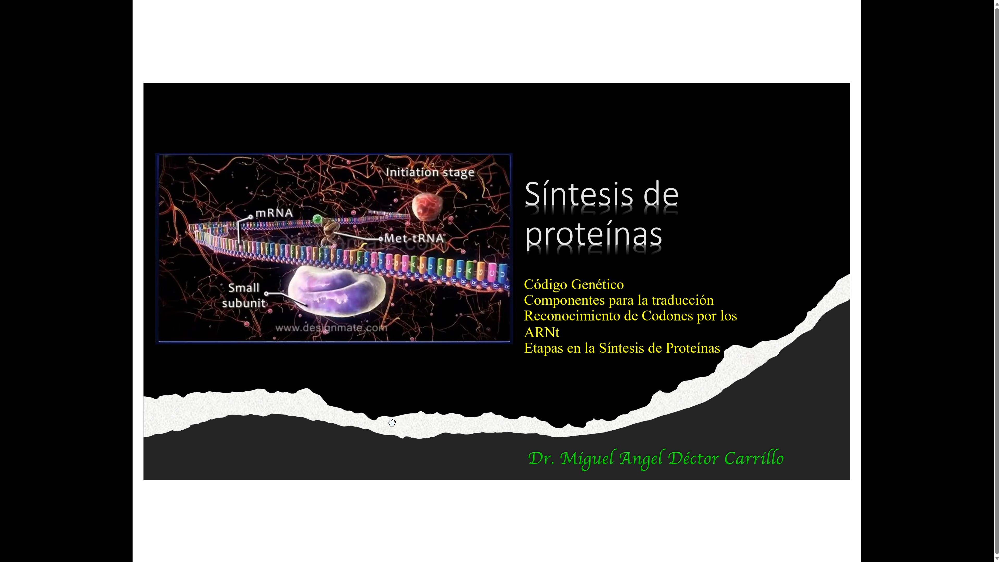
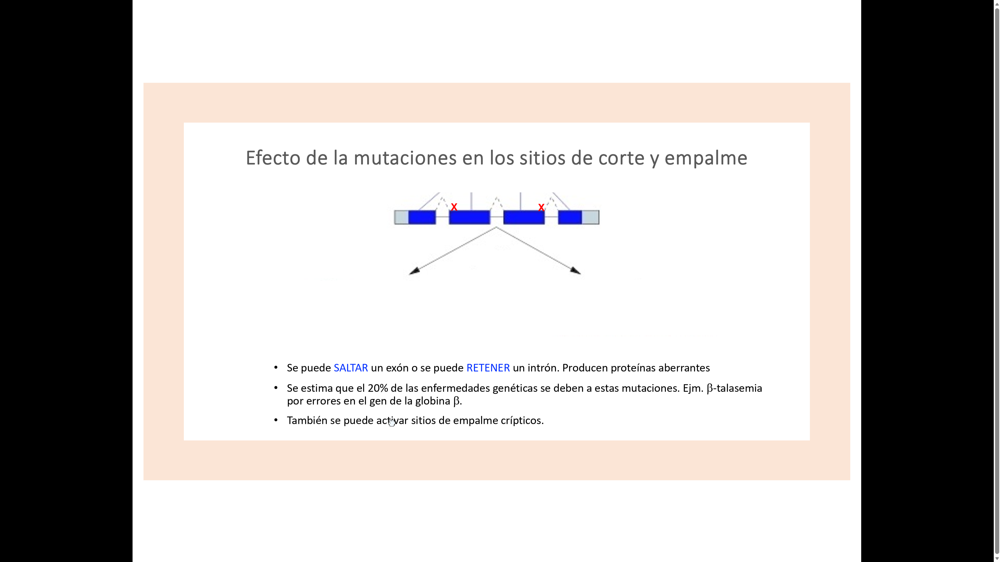
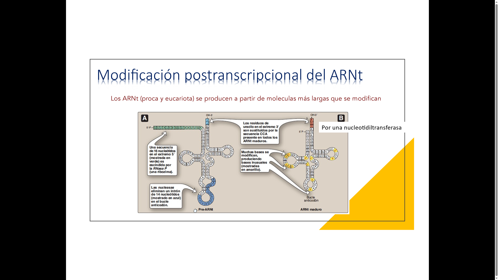

# Guía 6. Traducción y mutaciones

## Propósito

Relacionar el ARN mensajero con la síntesis de proteínas y analizar cómo los cambios en el ADN pueden modificar el producto proteico.

## Objetivos

- Interpretar codones, anticodones y código genético.
- Describir iniciación, elongación y terminación de la traducción.
- Ubicar los sitios A, P y E del ribosoma.
- Clasificar mutaciones según su efecto en la proteína.

## Ideas esenciales

La traducción convierte la secuencia de codones del ARN mensajero en una secuencia de aminoácidos. El ribosoma coordina al ARN mensajero y los ARN de transferencia. En términos generales, el ARNt entra por el sitio A, el péptido en crecimiento se encuentra en el sitio P y el ARNt descargado sale por el sitio E.

La iniciación establece el marco de lectura; la elongación incorpora aminoácidos y forma enlaces peptídicos; la terminación ocurre cuando un codón de paro es reconocido por factores de liberación. En eucariotas, las señales Kozak favorecen el inicio; en bacterias, la secuencia Shine-Dalgarno ayuda a posicionar el ribosoma.

Una sustitución puede ser silenciosa, cambiar un aminoácido o generar un codón de paro. Las inserciones y deleciones que no son múltiplos de tres pueden cambiar el marco de lectura. El efecto final depende de la región afectada, del cambio químico y de la función de la proteína.

Durante o después de la traducción, algunas proteínas requieren plegamiento, modificaciones o direccionamiento. Un péptido señal puede dirigir una proteína al retículo endoplásmico rugoso y, posteriormente, al aparato de Golgi. La entrada en la ruta secretora suele comenzar mientras se sintetiza la proteína.

## Del codón a la proteína

La aminoacil-ARNt sintetasa carga cada ARNt con su aminoácido correspondiente. El apareamiento codón-anticodón coloca ese aminoácido según el mensaje. El ribosoma lee ARNm 5' a 3' y forma el polipéptido desde el extremo amino al carboxilo.

En iniciación el ARNt iniciador ocupa el sitio P. En elongación entra un aminoacil-ARNt al sitio A, se transfiere la cadena y ocurre translocación. UAA, UAG y UGA son codones de paro del código estándar: los reconocen factores de liberación, no un ARNt que lleve un aminoácido de paro.

| Cambio | Ejemplo en ARNm | Resultado |
| --- | --- | --- |
| Sinónima | GAA a GAG | Ambos codifican glutamato |
| Missense | GAA a GUA | Glutamato cambia a valina |
| Nonsense | UAU a UAA | Tirosina cambia a señal de paro |
| Inserción de una base | Cambia la agrupación desde el sitio afectado | Frameshift en una región codificante |
| Inserción de tres bases | Agrega un triplete | Conserva el marco, aunque puede alterar función |

Una mutación sinónima no cambia el aminoácido, pero no equivale necesariamente a una mutación funcionalmente neutra. La degeneración del código significa que varios codones especifican el mismo aminoácido; el bamboleo permite que un ARNt reconozca más de un codón compatible.

Una proteína destinada a secreción puede presentar un péptido señal reconocido por SRP, entrar por un translocón del RER y pasar al Golgi. El plegamiento y algunas modificaciones ocurren durante o después de la traducción. Los ejemplos de manosa-6-fosfato y lisosomas de los glosarios corresponden al modelo animal; las células vegetales utilizan rutas hacia vacuolas que no deben equipararse automáticamente con ese modelo.

## Ejemplo conceptual

`5'-AUG GAA UUU UGA-3'` se traduce como metionina, glutamato y fenilalanina; UGA termina. El anticodón complementario a AUG puede escribirse `3'-UAC-5'` o, invirtiendo su orientación, `5'-CAU-3'`.

## Definiciones fundamentales

| Término | Significado operativo |
| --- | --- |
| Traducción | Síntesis de un polipéptido utilizando la secuencia de codones de un ARNm |
| Ribosoma | Complejo de ARN y proteínas que coordina la lectura del ARNm y la formación del polipéptido |
| Codón | Triplete del ARNm que especifica un aminoácido o una señal de paro |
| Anticodón | Triplete del ARNt que reconoce un codón por complementariedad |
| Marco de lectura | Agrupación en tripletes que usa el ribosoma desde el inicio |
| Aminoacil-ARNt | ARNt unido al aminoácido correspondiente |
| Código degenerado | Propiedad por la que varios codones especifican un mismo aminoácido |
| Mutación sinónima | Sustitución que conserva el aminoácido codificado |
| Mutación de sentido cambiado | Sustitución que cambia el aminoácido codificado; también llamada missense |
| Mutación sin sentido | Sustitución que convierte un codón de aminoácido en un codón de paro; también llamada nonsense |
| Cambio de marco | Alteración de la agrupación en tripletes de una región codificante |
| Péptido señal | Secuencia de aminoácidos que contribuye a dirigir una proteína hacia una ruta o destino celular |

## Preguntas y respuestas conceptuales

### 1. ¿Qué relación existe entre codón y anticodón?

**Respuesta:** el codón pertenece al ARNm y el anticodón al ARNt. Se reconocen por complementariedad y orientación antiparalela, permitiendo colocar un aminoácido según el mensaje.

### 2. ¿Quién une el aminoácido correcto al ARNt?

**Respuesta:** la aminoacil-ARNt sintetasa correspondiente. La selección del aminoácido y del ARNt contribuye a la fidelidad de la traducción.

### 3. ¿En qué dirección se leen el mensaje y la proteína?

**Respuesta:** el ribosoma lee el ARNm de 5' a 3'. El polipéptido crece desde el extremo amino hacia el extremo carboxilo.

### 4. ¿Qué función tienen los sitios A, P y E?

**Respuesta:** A recibe el aminoacil-ARNt durante la elongación; P mantiene el ARNt asociado con la cadena antes de su transferencia; E permite la salida del ARNt descargado. Durante la iniciación, el ARNt iniciador se coloca directamente en P.

### 5. ¿Qué sucede cuando aparece un codón de paro?

**Respuesta:** los factores de liberación reconocen UAA, UAG o UGA en el código estándar y favorecen la liberación del polipéptido. No existe un aminoácido de paro transportado por un ARNt convencional.

### 6. ¿Qué significan degeneración del código y bamboleo?

**Respuesta:** la degeneración significa que varios codones pueden especificar el mismo aminoácido. El bamboleo permite a ciertos ARNt reconocer más de un codón compatible; no implica que cualquier codón codifique cualquier aminoácido.

### 7. ¿Qué diferencia hay entre mutación sinónima, missense y nonsense?

**Respuesta:** una sinónima conserva el aminoácido; una missense cambia el aminoácido; una nonsense introduce un codón de paro donde antes se codificaba un aminoácido.

### 8. ¿Por qué una inserción de una base puede afectar muchos aminoácidos?

**Respuesta:** dentro de una región codificante cambia la agrupación de los nucleótidos posteriores en tripletes. Una inserción de tres bases conserva el marco, aunque puede modificar la secuencia y función de la proteína.

### 9. ¿Una mutación sinónima es siempre neutra?

**Respuesta:** no. Aunque conserve el aminoácido, puede afectar aspectos como procesamiento del ARN, estabilidad o eficiencia de traducción. La ausencia de cambio proteico directo no garantiza ausencia de efecto funcional.

### 10. ¿Qué funciones cumplen Shine-Dalgarno y Kozak?

**Respuesta:** Shine-Dalgarno ayuda a posicionar el ribosoma en muchos ARNm bacterianos. El contexto Kozak contribuye al reconocimiento del inicio de traducción en eucariotas. No son señales idénticas ni universales para todos los mensajes.

### 11. ¿Cómo puede una proteína entrar en la ruta secretora?

**Respuesta:** un péptido señal puede ser reconocido por SRP y dirigir el complejo hacia el retículo endoplásmico rugoso, donde la proteína atraviesa un translocón. Posteriormente puede pasar al Golgi y dirigirse a su destino.

### 12. ¿Cambiar un aminoácido demuestra una mejora agronómica?

**Respuesta:** no. El cambio molecular debe relacionarse con actividad, expresión y fenotipo mediante evidencia. Puede mejorar, reducir o no modificar una función, según la proteína y el contexto.

## Desarrollo para examen

### Maquinaria y secuencia de traducción

**ARNm** lleva el mensaje; **ARNt** es el adaptador entre codón y aminoácido; **ARNr** forma el núcleo estructural y catalítico del ribosoma. La secuencia CCA del extremo 3' de ARNt recibe el aminoácido; el anticodón ocupa una región diferente. El ARNt posee estructura secundaria de trébol y estructura tridimensional semejante a L. CCA puede estar codificada o añadirse por una nucleotidiltransferasa; no todos los ARNt tienen intrón.

| Etapa | Eventos | Energía y resultado |
| --- | --- | --- |
| Carga del ARNt | Sintetasa reconoce aminoácido y ARNt; algunas revisan errores | Utiliza ATP y produce aminoacil-ARNt |
| Iniciación | Subunidad pequeña, factores y ARNt iniciador reconocen inicio; se une la grande | Define el marco; ARNt iniciador en P |
| Elongación: selección | Factor de elongación entrega ARNt compatible a A | GTP contribuye a selección y entrega |
| Enlace peptídico | Centro peptidil transferasa transfiere cadena desde ARNt de P al aminoácido de A | La cadena queda temporalmente en A; actividad catalítica fundamental de ARNr |
| Translocación | Ribosoma avanza un codón; ARNt con cadena pasa de A a P y el descargado hacia E | Factores y GTP coordinan avance |
| Terminación y reciclaje | Factores reconocen paro, hidrolizan unión del péptido al ARNt y reciclan maquinaria | Polipéptido liberado y componentes reutilizables |

En bacterias, el iniciador lleva normalmente formilmetionina; en el citoplasma eucariota, metionina. En el modelo eucariota habitual, el complejo pequeño reconoce la caperuza y explora el ARNm hasta un inicio en contexto adecuado. AUG también puede codificar metionina interna: no todo AUG inicia. **Polisoma** es un conjunto de ribosomas que traducen simultáneamente un mismo ARNm.

Ribosomas bacterianos son 70S, con subunidades 30S y 50S; citoplasmáticos eucariotas son 80S, con 40S y 60S. S es una unidad de sedimentación dependiente de tamaño y forma, no una masa que se sume aritméticamente. Plastidios tienen ribosomas de tipo bacteriano y los mitocondriales varían; 80S no describe todos los ribosomas de una planta.

### Código genético estándar completo

Los codones se escriben en ARN 5' a 3'. La primera base se combina con la segunda para elegir la fila; la tercera selecciona una de las cuatro columnas. La tabla describe el código estándar; existen variantes, especialmente organelares, y casos de recodificación.

| Primera y segunda bases | Tercera U | Tercera C | Tercera A | Tercera G |
| --- | --- | --- | --- | --- |
| UU | Fenilalanina | Fenilalanina | Leucina | Leucina |
| UC | Serina | Serina | Serina | Serina |
| UA | Tirosina | Tirosina | Paro | Paro |
| UG | Cisteína | Cisteína | Paro | Triptófano |
| CU | Leucina | Leucina | Leucina | Leucina |
| CC | Prolina | Prolina | Prolina | Prolina |
| CA | Histidina | Histidina | Glutamina | Glutamina |
| CG | Arginina | Arginina | Arginina | Arginina |
| AU | Isoleucina | Isoleucina | Isoleucina | Metionina |
| AC | Treonina | Treonina | Treonina | Treonina |
| AA | Asparagina | Asparagina | Lisina | Lisina |
| AG | Serina | Serina | Arginina | Arginina |
| GU | Valina | Valina | Valina | Valina |
| GC | Alanina | Alanina | Alanina | Alanina |
| GA | Aspartato | Aspartato | Glutamato | Glutamato |
| GG | Glicina | Glicina | Glicina | Glicina |

### Mutaciones, plegamiento y destino

**Sustitución:** cambio de una base por otra; **transición:** purina por purina o pirimidina por pirimidina; **transversión:** intercambio entre esas clases. **Inserción** añade nucleótidos y **deleción** los elimina. **Duplicación** repite un segmento; **inversión** cambia su orientación; **translocación cromosómica** reorganiza segmentos entre ubicaciones cromosómicas. No es la translocación del ribosoma. Cambios en promotores, UTR o sitios de empalme pueden alterar cantidad o procesamiento sin modificar directamente un codón.

Una proteína naciente puede plegarse con ayuda de **chaperonas**, proteínas que favorecen plegamiento y evitan agregación, sin determinar por sí solas la secuencia. **SRP** es la partícula de reconocimiento de señal; reconoce una señal compatible con RER y dirige el complejo hacia un receptor y un **translocón**, canal de entrada. Proteínas secretadas o de membrana pueden transitar por RER y Golgi; proteínas citosólicas no pasan obligatoriamente por ellos. Las destinadas a núcleo, mitocondrias o plastidios usan señales y rutas distintas.

### 13. ¿Por qué ARNt y aminoácido deben reconocerse correctamente antes de entrar al ribosoma?

**Respuesta:** el ribosoma comprueba principalmente la compatibilidad codón-anticodón; un ARNt mal cargado puede introducir un aminoácido incorrecto aunque reconozca el codón. Las sintetasas aportan una etapa de fidelidad diferente.

### 14. ¿En qué sitio queda el péptido inmediatamente después de formar el enlace?

**Respuesta:** queda unido al ARNt de A. Después de translocación, ese ARNt pasa a P. Por eso decir que la cadena siempre está en P es una simplificación incompleta.

### 15. ¿Quién cataliza el enlace peptídico?

**Respuesta:** el centro peptidil transferasa de la subunidad grande tiene una función catalítica basada fundamentalmente en ARNr. El ribosoma es una ribonucleoproteína con actividad de ribozima.

### 16. ¿Por qué 30S y 50S forman 70S y no 80S?

**Respuesta:** S mide sedimentación, que depende de forma y fricción además de tamaño. Sus valores no son cantidades de masa sumables.

### 17. ¿Un codón puede significar varios aminoácidos en el código estándar?

**Respuesta:** normalmente un codón especifica un solo aminoácido o paro; la degeneración es la relación inversa, varios codones para un aminoácido. Hay recodificaciones especiales que deben indicarse explícitamente.

### 18. ¿Un codón de paro prematuro siempre produce una proteína truncada detectable?

**Respuesta:** no. Puede liberar una proteína más corta, pero también favorecer degradación del mensajero mediante vigilancia, según el contexto. No se puede deducir la cantidad de proteína solo del cambio de codón.

### 19. ¿Qué efecto puede tener una mutación en un sitio de empalme?

**Respuesta:** puede provocar salto de exón, retención de intrón o utilización de un sitio alternativo. Su efecto depende de la secuencia, el marco y el destino del ARN; no siempre se produce una proteína aberrante estable.

### 20. ¿Una inserción de tres bases siempre añade exactamente un aminoácido sin cambiar otros?

**Respuesta:** conserva el marco posterior si ocurre dentro de la región codificante, pero si cae dentro de un codón también puede cambiar aminoácidos locales. Conservar el marco no garantiza conservar función.

### 21. ¿Qué diferencia hay entre polisoma y ARNm policistrónico?

**Respuesta:** polisoma describe varios ribosomas sobre un mensaje. Policistrónico describe varias regiones traducibles en ese mensaje. Un ARNm monocistrónico también puede formar polisomas.

### 22. ¿Todas las proteínas necesitan pasar por Golgi?

**Respuesta:** no. Muchas permanecen en citosol o siguen rutas hacia núcleo u organelos. Golgi participa principalmente en procesamiento y distribución de proteínas de la ruta secretora.

### 23. ¿La modificación postraduccional equivale a mutación?

**Respuesta:** no. Fosforilación, glucosilación o cortes proteolíticos alteran una proteína después de su síntesis sin cambiar necesariamente el ADN. Una mutación modifica la información genética.

## Capturas de las referencias

Las imágenes conservan su archivo original. Amplía cada captura para revisar sus rótulos. Las aclaraciones de esta guía prevalecen sobre las erratas señaladas.

### Captura C04. ARN de transferencia

### Captura C72. Portada: síntesis de proteínas

### Captura C82. Mutaciones en sitios de empalme

### Captura C86. Procesamiento del ARNt

[Volver al índice](guias-biologia-celular.md) · [Catálogo de capturas](capturas-referencias.md)
